# Mac上为iOS交叉编译osip2和eXosip2

- 为什么要编译这两个库？  
  这两个库对SIP协议进行了很好的封装，很多开发者都是用到它，支持大部分平台，兼容性好。

- 编译的大概流程

**step1:**

下载osip2 和 eXosip2 的编译源码，这里我选择的是最新版本  
地址：[http://www.antisip.com/download/exosip2/](https://links.jianshu.com/go?to=http%3A%2F%2Fwww.antisip.com%2Fdownload%2Fexosip2%2F)  

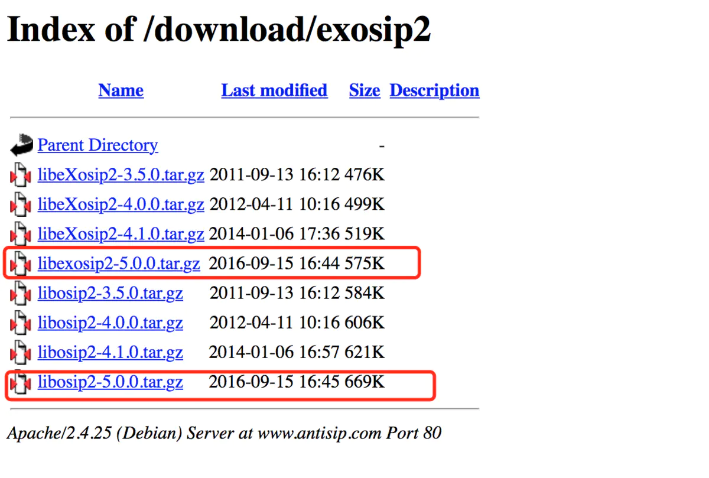

**step2：**  

解压后分别对这个两个库进行编译  
先编译`osip2`这个库，因为`eXosip2`编译的时候需要依赖`libosip2.a` 和 `libosipparser2.a`  
需要⚠️的地方：  
`"iPhoneOS11.4.sdk"`需要改成当前Xcode的sdk包名称  
`"-arch arm64"` 这里因为网络电话只能支持真机，所以我只支持了 arm64 ，模拟器和5s以下的机器都没有兼容。此处可以根据需要，依葫芦画瓢打出需要支持的库然后合并就好了。  
`"--prefix=/Users/jiangdesheng/Desktop/siplibs"` 这个是指定编译包的路径，打出来的包会放在这个路径下，但是我在编译完成的时候，该路径下没有找到，但是也没有关系，可以通过`$ find . -iname "*.a"` 这个命令行找到对应的路径下的.a文件。  

$ ./configure CC=/Applications/Xcode.app/Contents/Developer/Toolchains/XcodeDefault.xctoolchain/usr/bin/clang CFLAGS="-DPJ_SDK_NAME="/"iPhoneOS11.4.sdk/"" -arch arm64 -isysroot /Applications/Xcode.app/Contents/Developer/Platforms/iPhoneOS.platform/Developer/SDKs/iPhoneOS11.4.sdk" --host=arm-apple-darwin9 --target=arm-apple-darwin9 --prefix=/Users/jiangdesheng/Desktop/siplibs

然后编译`eXosip2`  

⚠️的地方：`"iPhoneOS11.4.sdk/"`、`-arch arm64 -`、`--prefix=/Users/jiangdesheng/Desktop/siplibs`跟上面的是一致的。

./configure CC=/Applications/Xcode.app/Contents/Developer/Toolchains/XcodeDefault.xctoolchain/usr/bin/clang CFLAGS="-DPJ_SDK_NAME="/"iPhoneOS11.4.sdk/"" -arch arm64 -isysroot /Applications/Xcode.app/Contents/Developer/Platforms/iPhoneOS.platform/Developer/SDKs/iPhoneOS11.4.sdk" LDFLAGS=" -framework MobileCoreServices -framework CFNetwork -framework CoreFoundation" --disable-openssl --host=arm-apple-darwin9 --target=arm-apple-darwin9 --prefix=/Users/jiangdesheng/Desktop/siplibs

- 遇到的错误：  
  **错误1:**  
  
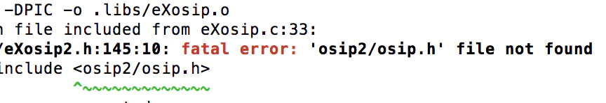

  **解决：**把`osip2`的`include`文件夹下的子目录拷贝到`eXosip2`的`include`目录下方  

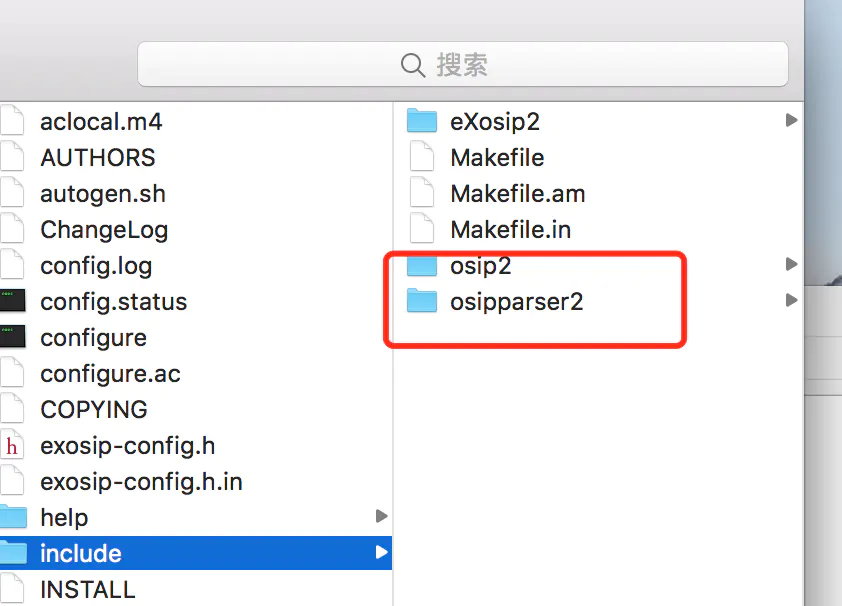

  **错误2：**  

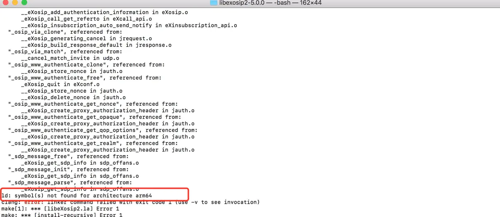

  **解决：**

出错的原因是之前打包的`libosip2.a` 和 `libosipparser2.a`不是arm64的结构，可以通过 `$ lipo -info 路径`查看，把`armv7`改成`arm64`，重新编译`osip2库`就好了

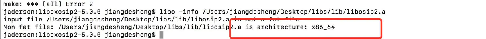

  **错误3**  

  找不到对应的依赖库`libosip2.a` 和 `libosipparser2.a`  

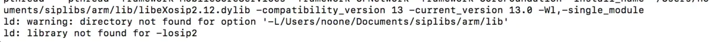

  解决：需要把`libosip2.a` 和 `libosipparser2.a`这个两个文件拷贝到指定的`prefix=/Users/jiangdesheng/Desktop/siplibs`路径下面，里面已经有编译好的两个.a文件则不会出错，也不需要再copy了。

**错误4**  

这个错误是以为编译环境没问题 ，调用的`eXosip`库的代码时，还是报错了。  

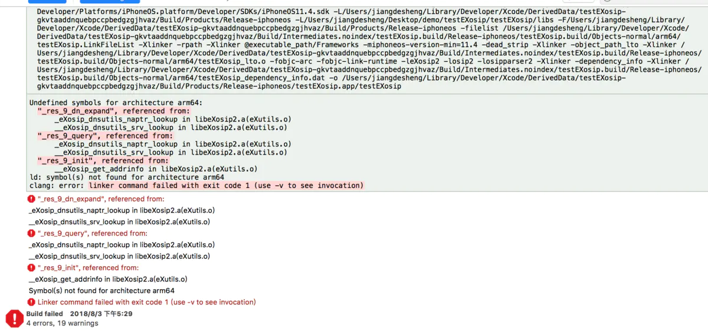

**解决：**  

在Build Settings -> other linker flags 中添加-lresolv ,再次编译 ，没有报错。  

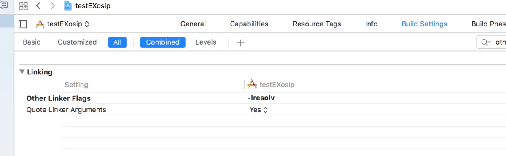

**错误5：**头文件的引用问题.  

1.缺少`#include <netdb.h>`  

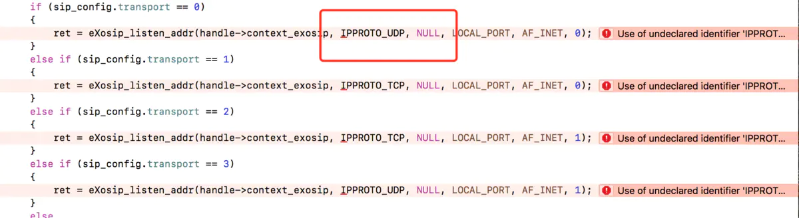

2.缺少`#include <stdlib.h>`  

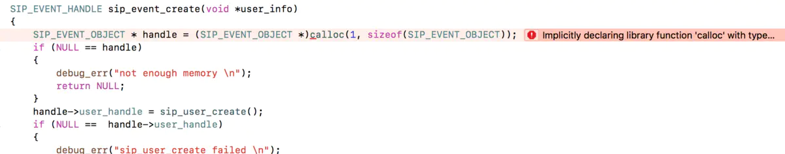

3.缺少`#include <pthread.h>`  

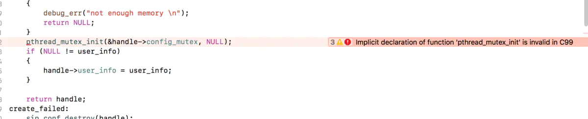

---

- 至此，以iOS平台为目标编译库踩坑结束，开始进入码代码的深坑

> 参考文章  
> [https://blog.csdn.net/tanningzhong/article/details/51323353](https://links.jianshu.com/go?to=https%3A%2F%2Fblog.csdn.net%2Ftanningzhong%2Farticle%2Fdetails%2F51323353)  
> [https://www.aliyun.com/jiaocheng/694757.html?spm=5176.100033.2.5.NtFPff](https://links.jianshu.com/go?to=https%3A%2F%2Fwww.aliyun.com%2Fjiaocheng%2F694757.html%3Fspm%3D5176.100033.2.5.NtFPff)

- demo 地址：[https://github.com/SenJiang/sipDemo](https://links.jianshu.com/go?to=https%3A%2F%2Fgithub.com%2FSenJiang%2FsipDemo)

作者：monkey姜啦  

链接：https://www.jianshu.com/p/b6287f9bef46  

来源：简书  

著作权归作者所有。商业转载请联系作者获得授权，非商业转载请注明出处。