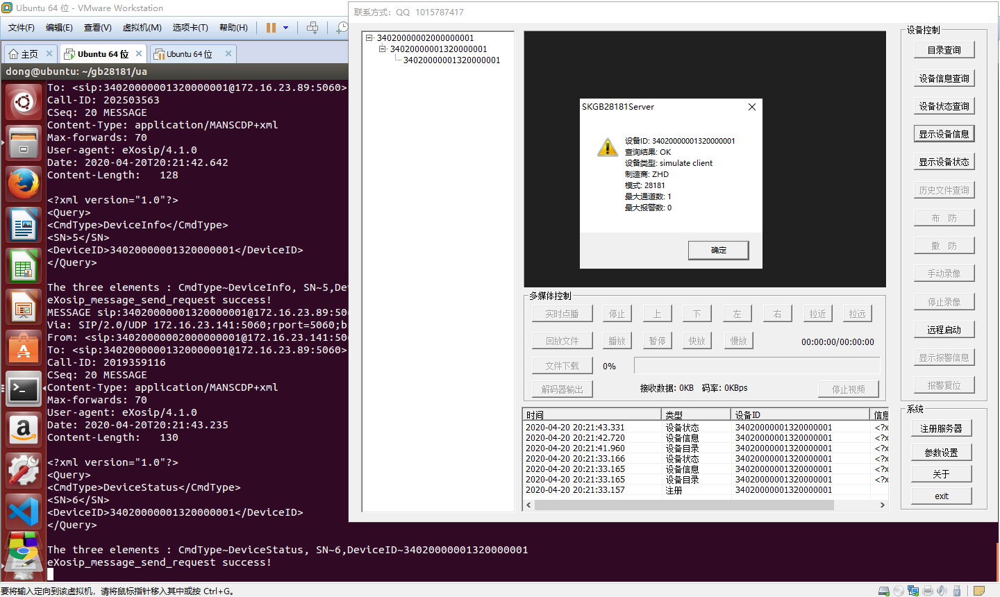
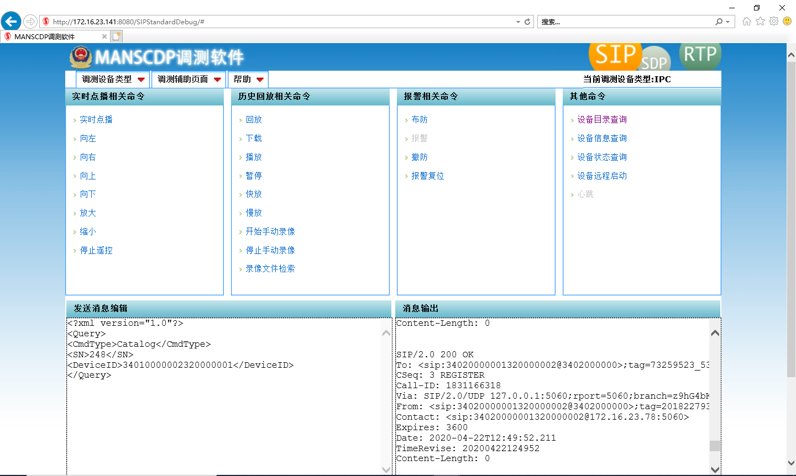
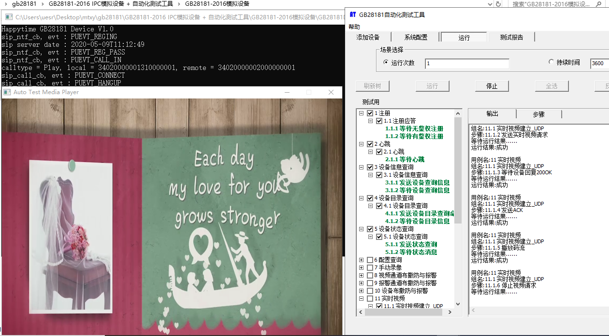
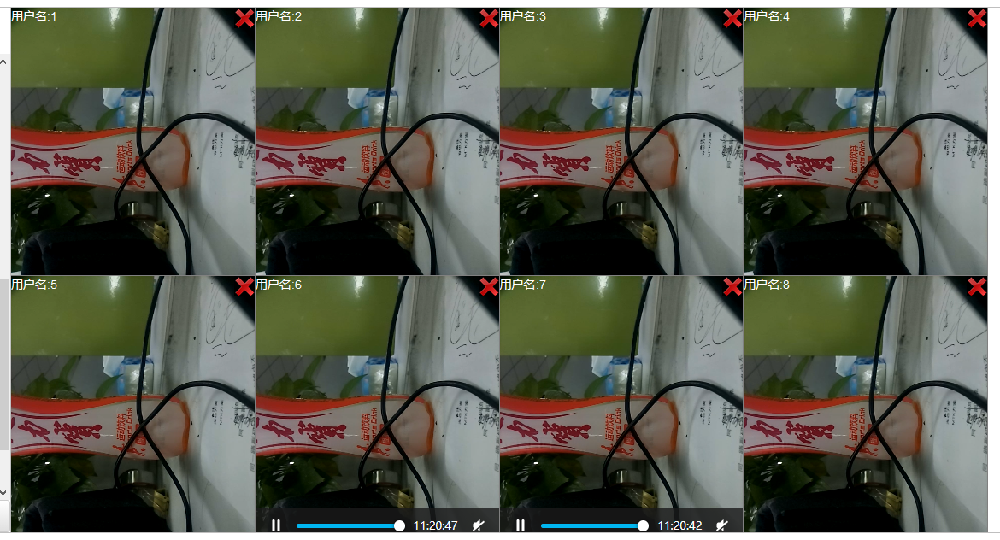

# [SIP UA/GB28181-Server/GB28181-Client](https://www.cnblogs.com/dong1/p/12607489.html)

感谢网友[larkguo](https://github.com/larkguo/SIP_UA/blob/master/ua.c)整理的sip ua示例，完善，对味 ！小改一下就能实现/uac/uas/gb28181-server/gb28181-client

[SIP_UA/ua.c at master · larkguo/SIP_UA · GitHub](https://github.com/larkguo/SIP_UA/blob/master/ua.c)

**1. 功能改造**

1. 启动参数太长，可以把参数放到配置文件

gb28181.client.ini

```
; Test config file for ini_example.c and INIReaderTest.cpp
[UA]
;SIP
role = UAC
server_id = 34020000002000000001 server_ip = 172.16.23.89 server_port = 5060 user_id = 34020000001320000111 user_ch = 34020000001320000111 passwd = 12345678 user_port = 5060 expiry = 3600 heartbeat = 60 transport = UDP
```

gb28181.server.ini

```
; Test config file for ini_example.c and INIReaderTest.cpp
[UA]
;;;;;;;;;;;;;;;;;; Local Platform ;;;;;;;;;;;;;;;;;;;;
;SIP
role = UAS
server_id = 34020000002000000001 passwd = 12345678 server_port = 5060 transport = UDP
;RTP
rtp_port_fix = close
rtp_port_fix_port = 6000 rtp_port_start = 15000 rtp_port_end = 15100 ;RESTFUL
restful_port = 10000 ;RTMP
rtmp_port = 1935;
http_flv_port = 8081;
;;;;;;;;;;;;;;;;;; Upper Level Platform ;;;;;;;;;;;;;;;;
upper_level_platform = close
upper_server_id = 34020000002000000002 upper_server_ip = 172.16.23.125 upper_passwd = 12345678 upper_server_port = 5060 upper_expiry = 3600 upper_heartbeat = 30 upper_transport = UDP
```

2. [larkguo](https://github.com/larkguo/SIP_UA/blob/master/ua.c) 的ua示例是个SIP网络代理终端(sip user agent)，代理终端一般应用在背靠背的网络的环境(ua1~proxy~ua2)。

因为网络代理既包含了服务端，又包含了客户端，所以只需要屏蔽一行代码(去掉代理模式)，就能改造成CS环境(uac~uas)的应用。

```
//eXosip_set_user_agent(g_core.context, UA_VERSION);
```

简单的gb28181系统也可以是CS结构，如果需要级联，国标服务器需要配置成SIP代理模式。

为了省事，我的语音对讲，国标客户端，国标服务器全部配成同样的代理模式，一个程序解决三个功能。

而且通过这个SIP代理小程序很容易配置成1个服务器+n个客户端的服务单元

然后将n个服务单元级联或者互联(树状或者网状拓扑)可以组成大规模国标监控系统

3. 加一个参数role来区分ua/uac/uas/gb28181-client/gb28181-server

ua.c

```
/* SIP User Agent Sample -- by larkguo@gmail.com
Intercom/GB28181-Server/GB28181-Client Agent Sample -- by zhoudd
This program is free software; you can redistribute it and/or
modify it under the terms of the GNU General Public License
as published by the Free Software Foundation; either version 2
of the License, or (at your option) any later version.
This program is distributed in the hope that it will be useful,
but WITHOUT ANY WARRANTY; without even the implied warranty of
MERCHANTABILITY or FITNESS FOR A PARTICULAR PURPOSE.  See the
GNU General Public License for more details.
You should have received a copy of the GNU General Public License
along with this program; if not, write to the Free Software
Foundation, Inc., 59 Temple Place - Suite 330, Boston, MA  02111-1307, USA.
1.Architecture:
    UA ==command==> eXosip2
    UA <==notify==  eXosip2
2.Requires:
    libosip2-5.0.0
    libeXosip2-5.0.0
3.Compile:(assumed that osip2 & eXosip2 are installed in /usr/local)
    gcc -I/usr/local/include -L/usr/local/lib ua.c -o ua -leXosip2 \
    -losip2 -losipparser2 -lpthread
4.Run:
    export LD_LIBRARY_PATH+=/usr/local/lib:
    ./ua -r sip:DOMAIN-OR-IP -R sip:X.X.X.X:5060 -f sip:FROM-USER@DOMAIN \
    -t sip:TO-USER@DOMAIN -U AUTH-USER -P AUTH-PASSWORD
5.Register:
    UAC/UAS        PROXY
    1  -REGISTER->
        <-401-
        -REGISTER(auth)->
        <-200-
6.Call:
    UAC  (PROXY)    UAS
    2  -INVITE->
        <-407-
        -INVITE(auth)->
        <-180-
        <-200-        3
        -ACK->
    4  -reINVITE->
        <-200-
        -ACK->
    5  -BYE->
        <-200- */ #include <stdio.h> #include <stdbool.h> #include <stdlib.h> #include <unistd.h> #include <errno.h> #include <string.h> #include <signal.h> #include <pthread.h> #include <time.h> #include <sys/time.h> #include <sys/types.h> #include <sys/socket.h> #include <netinet/in.h> #include <arpa/inet.h> #include <netdb.h> #include <ifaddrs.h> #include <osip2/osip_mt.h> #include <eXosip2/eXosip.h> #include "HTTPDigest.h" #include "ini.h" #include "util.h"

#define    UA_CMD_REGISTER        ('1')
#define    UA_CMD_CALL_START    ('2')
#define    UA_CMD_CALL_ANSWER    ('3')
#define    UA_CMD_CALL_KEEP    ('4')
#define    UA_CMD_CALL_STOP    ('5')
#define    UA_CMD_UNREGISTER    ('6')
#define    UA_CMD_HELP            ('h')
#define    UA_CMD_QUIT            ('q') #ifdef UAS_DISABLE_LOG #define uaslog(msg, ...) (void)0
#else
    #define uaslog(msg, ...) printf("[%s] ", get_time());printf(msg, ##__VA_ARGS__);printf("\n")
#endif #ifdef UA_DISABLE_LOG #define ualog(a,b...) (void)0
#else
    #define ualog(a,b...) fprintf(stderr,b);fprintf(stderr,"\n>")
#endif

#define null_if_empty(s) (((s)!=NULL&&(s)[0]!='\0')?(s):NULL)
#define UA_VERSION "SipUAv0.1"
#define UAS_VERSION "SipUASv0.1"
#define    BUFFER_LEN (1024)
#define DEVICE_DESCRIPTOR_LEN 64

#define THREAD_GROUP     (4)

/*rtp send/recv thread group*/
enum{SEND, RECV, SOURCE, DESTROY};
typedef struct { const char *role; const char *server_id; const char *user_id; const char* passwd; const char *server_ip; int server_port; const char *user_ip; int user_port; const char* transport; const char* rtp_port_fix; int rtp_port_fix_port; int rtp_port_start; int rtp_port_end; int heartbeat; int expiry;
} config_ua_t; /*task bridge*/ typedef struct task
{ /*user*/ }task_t;
typedef struct ua_core{ /* config */
    int expiry; int localport; int calltimeout; char *proxy; char *outboundproxy; char *username; char *password; char *realm; char *nonce; char *from; char *to; char *contact; char *localip; char *firewallip; char *transport; char *role; /* dynamic */
    struct eXosip_t *context;
    pthread_t ua_notifythread; int running; int regid; int callid; int dialogid; int transactionid; int cmd; /*media channel task*/ config_ua_t *config_ua; //task_t **task;
 uint32_t rtp_port;
    uint32_t media_index; int media_proto; int media_req_mode;
    pthread_mutex_t lock;
} uacore; static uacore g_core; /*UA Functions*/
static void ua_cmd_usage(void); static int ua_add_outboundproxy(osip_message_t *msg, const char *outboundproxy); static int ua_cmd_register(uacore *core); static int ua_cmd_unregister(uacore *core); static int ua_cmd_callstart(uacore *core, char *sdp); static int ua_cmd_callring(uacore *core); static int ua_cmd_callanswer(uacore *core, char *sdp); static int ua_cmd_callkeep(uacore *core); static int ua_cmd_callstop(uacore *core); static int ua_notify_callack(uacore *core, eXosip_event_t *je); static int ua_notify_callkeep(uacore *core, eXosip_event_t *je); static int ua_notify_keepalive(uacore *core, eXosip_event_t *je); static void *ua_notify_thread(void *arg); static int ua_printf_msg(eXosip_event_t* je, int ch); /*GB28181 UAS Functions*/
static void uas_cmd_usage(void); static void ua_register401_unauthorized_response(uacore *core, eXosip_event_t *je); static void ua_auth_calc_response(uacore *core, char *username, char *uri, char *method, HASHHEX response); static void ua_register_success_response(uacore *core, eXosip_event_t *je); static void ua_register_failed_response(uacore *core, eXosip_event_t *je); /*GB28181 UAC Functions*/
static int ua_device_info_response(char* SN, char* DeviceID, char* rsp_xml_body); static int ua_device_boot_response(char* SN, char* DeviceID, char* rsp_xml_body); static int ua_device_status_response(char* SN, char* DeviceID, char* rsp_xml_body); static int ua_catalog_response(char* SN, char* DeviceID, char* rsp_xml_body); static int get_str( const char* data, const char* s_mark, bool with_s_make, const char* e_mark, bool with_e_make, char* dest ); /*Util Functions*/
static void usage(void); static int init(uacore *core); static void stop(int signum); static int quit(uacore *core); static void usage(void){ #define short_options "r:f:t:k:U:P:X:Y:T:b:e:p:c:l:F:R:hv" printf("Usage: " UA_VERSION " [required] [optional]\n"
        "\n\t[required]\n"
        "\t-r --proxy\tsip:proxyhost[:port]\n"
        "\t-f --fromuser\tsip:fromuser@host[:port]\n"
        "\n\t[optional]\n"
        "\t-t --touser\tsip:touser@host[:port]\n"
        "\t-U --username\tauthentication username\n"
        "\t-P --password\tauthentication password\n"
        "\t-X --realm\tauthentication realm\n"
        "\t-Y --nonce\tauthentication nonce\n"
        "\t-T --transport\tUDP|TCP|TLS|DTLS(default UDP)\n"
        "\t-b --role\tUA|UAS|UAC(default UA)\n"
        "\t-e --expiry\tnumber(default 3600)\n"
        "\t-p --port\tnumber(default 5060)\n"
        "\t-c --contact\tsip:user@host[:port]\n"
        "\t-l --localip\tX.X.X.X(force local IP address)\n"
        "\t-k --keep\tcall keep timeout(default 1800)\n"
        "\t-F --firewallip\tX.X.X.X\n"
        "\t-R --route\toutboundproxy or SBC or P-CSCF(sip:outboundproxyhost[:port])\n"
        "\n\t[help]\n"
        "\t-v --version\n"
        "\t-h --help\n"
        "\n\t[uas example]\n"
        "\tua -r sip:192.168.1.X:5060 -f sip:1001@domain.com"
        " -U 1001 -P 1001 -p 5080\n"
        "\n\t[uac example]\n"
        "\tua -r sip:domain.com -R sip:192.168.1.X:5060 -f sip:1002@domain.com"
        " -t sip:1001@domain.com -U 1002 -P 1002\n"
        "\n\t[ims uac example]\n"
        "\tua -r sip:domain.com -R sip:192.168.1.X:5060 -f sip:1002@domain.com"
        " -t sip:1001@domain.com -U 1001@domain.com -P 1002\n\n" );
} static void ua_cmd_usage(void){
    printf("please select:\n"
        "\t1: register\n"
        "\t2: call start\n"
        "\t3: call answer\n"
        "\t4: call keep\n"
        "\t5: call stop\n"
        "\t6: unregister\n"
        "\th: help\n"
        "\tq: quit\n");
} static void uas_cmd_usage(void){
    printf("please select:\n"
        "\t2: call start\n"
        "\t5: call stop\n"
        "\th: help\n"
        "\tq: quit\n");
} static int init(uacore *core){
    core->proxy = (char*)calloc(1, sizeof(char)*DEVICE_DESCRIPTOR_LEN);
    core->from = (char*)calloc(1, sizeof(char)*DEVICE_DESCRIPTOR_LEN);
    core->to = (char*)calloc(1, sizeof(char)*DEVICE_DESCRIPTOR_LEN);
    core->contact = (char*)calloc(1, sizeof(char)*DEVICE_DESCRIPTOR_LEN);
    core->localip = (char*)calloc(1, sizeof(char)*DEVICE_DESCRIPTOR_LEN);
    core->username = (char*)calloc(1, sizeof(char)*DEVICE_DESCRIPTOR_LEN);
    core->password = (char*)calloc(1, sizeof(char)*DEVICE_DESCRIPTOR_LEN);
    core->realm = (char*)calloc(1, sizeof(char)*DEVICE_DESCRIPTOR_LEN);
    core->nonce = (char*)calloc(1, sizeof(char)*DEVICE_DESCRIPTOR_LEN);
    core->outboundproxy = (char*)calloc(1, sizeof(char)*DEVICE_DESCRIPTOR_LEN);
    core->firewallip = (char*)calloc(1, sizeof(char)*DEVICE_DESCRIPTOR_LEN);
    core->transport = (char*)calloc(1, sizeof(char)*DEVICE_DESCRIPTOR_LEN);
    core->role = (char*)calloc(1, sizeof(char)*DEVICE_DESCRIPTOR_LEN);
    core->config_ua = (config_ua_t*)calloc(1, sizeof(config_ua_t)); //core->task = (task_t**)calloc(1, sizeof(task_t*));
    pthread_mutex_init(&(core->lock), NULL); return 0;
} static int quit(uacore *core){ if (NULL != core->proxy) free(core->proxy); if (NULL != core->from) free(core->from); if (NULL != core->to) free(core->to); if (NULL != core->contact) free(core->contact); if (NULL != core->localip) free(core->localip); if (NULL != core->username) free(core->username); if (NULL != core->password) free(core->password); if (NULL != core->realm) free(core->realm); if (NULL != core->nonce) free(core->nonce); if (NULL != core->outboundproxy) free(core->outboundproxy); if (NULL != core->firewallip) free(core->firewallip); if (NULL != core->transport) free(core->transport); if (NULL != core->role) free(core->role); if (NULL != core->config_ua) free(core->config_ua); //if (NULL != core->task) free(core->task);
    pthread_mutex_destroy(&(core->lock)); return 0;
} static void stop(int signum){
    g_core.running = 0;
} #define REQUEST 1
#define RESPONSE 0
static int ua_printf_msg(eXosip_event_t* je, int ch)
{ char *dest=NULL;
    size_t length=0; int i=0; if (ch == 1)
        i = osip_message_to_str(je->request, &dest, &length); else if(ch == 0)
        i = osip_message_to_str(je->response, &dest, &length); if (i!=0)
    { return -1; 
    }
    printf("%s\n", dest);
    osip_free(dest); return 0;
} /*decode system config file*/
static int config_ua_handler(void* user, const char* section, const char* name, const char* value)
{
    config_ua_t* pconfig = (config_ua_t*)user; #define MATCH(s, n) strcmp(section, s) == 0 && strcmp(name, n) == 0
    if (MATCH("UA", "role")) {
        pconfig->role = strdup(value);
    } else if (MATCH("UA", "server_id")) {
        pconfig->server_id = strdup(value);
    } else if (MATCH("UA", "user_id")) {
        pconfig->user_id = strdup(value);
    } else if (MATCH("UA", "passwd")) {
        pconfig->passwd = strdup(value);
    } else if (MATCH("UA", "server_ip")) {
        pconfig->server_ip = strdup(value);
    } else if (MATCH("UA", "server_port")) {
        pconfig->server_port = atoi(value);
    } else if (MATCH("UA", "user_ip")) {
        pconfig->user_ip = strdup(value);
    } else if (MATCH("UA", "user_port")) {
        pconfig->user_port = atoi(value);
    } else if (MATCH("UA", "transport")) {
        pconfig->transport = strdup(value);
    }else if (MATCH("UA", "rtp_port_fix")) {
        pconfig->rtp_port_fix = strdup(value);
    } else if (MATCH("UA", "rtp_port_fix_port")) {
        pconfig->rtp_port_fix_port = atoi(value);
    } else if (MATCH("UA", "rtp_port_start")) {
        pconfig->rtp_port_start = atoi(value);
    } else if (MATCH("UA", "rtp_port_end")) {
        pconfig->rtp_port_end = atoi(value);
    } else if (MATCH("UA", "heartbeat")) {
        pconfig->heartbeat = atoi(value);
    } else if (MATCH("UA", "expiry")) {
        pconfig->expiry = atoi(value);
    } else { return 0;  /* unknown section/name, error */ } return 1;
} /***************************** command *****************************/
static int ua_add_outboundproxy(osip_message_t *msg, const char *outboundproxy)
{ int ret = 0; char head[BUFFER_LEN] = { 0 }; if (NULL == null_if_empty(outboundproxy)){ return 0;
    }
    snprintf(head, sizeof(head)-1, "<%s;lr>", outboundproxy);
    osip_list_special_free(&msg->routes, (void(*)(void*))osip_route_free);
    ret = osip_message_set_route(msg, head); return ret;
} static int ua_cmd_register(uacore *core)
{ int ret = -1;
    osip_message_t *msg = NULL; if (core->regid > 0){ // refresh register
        ret = eXosip_register_build_register(core->context, core->regid, core->expiry, &msg); if (0 != ret){
            ualog(LOG_ERR, "register %d refresh build failed %d", core->regid, ret); return -1;
        }
    } else{ // new register
        core->regid = eXosip_register_build_initial_register(core->context,
            core->from, core->proxy, core->contact, core->expiry, &msg); if (core->regid <= 0){
            ualog(LOG_ERR, "register build failed %d", core->regid); return -1;
        }
        ua_add_outboundproxy(msg, core->outboundproxy);
    }
    ret = eXosip_register_send_register(core->context, core->regid, msg); if (0 != ret){
        ualog(LOG_ERR, "register %d send failed", core->regid); return ret;
    } return ret;
} static int ua_cmd_unregister(uacore *core)
{ int ret = -1;
    osip_message_t *msg = NULL; int expiry = 0; //unregister 
 ret = eXosip_register_build_register(core->context, core->regid, expiry, &msg); if (0 != ret){
        ualog(LOG_ERR, "unregister %d build failed %d", core->regid, ret); return -1;
    }
    ret = eXosip_register_send_register(core->context, core->regid, msg); if (0 != ret){
        ualog(LOG_ERR, "register %d send failed %d", core->regid, ret); return ret;
    }
    core->regid = 0; return ret;
} static int ua_cmd_callstart(uacore *core, char *sdp)
{ int ret = -1; char session_exp[BUFFER_LEN] = { 0 };
    osip_message_t *msg = NULL;
    ret = eXosip_call_build_initial_invite(core->context, &msg, core->to, core->from, NULL, NULL); if (0 != ret){
        ualog(LOG_ERR, "call build failed %s %s", core->from, core->to); return -1;
    }
    ua_add_outboundproxy(msg, core->outboundproxy);
    osip_message_set_body(msg, sdp, strlen(sdp));
    osip_message_set_content_type(msg, "application/sdp"); /* UAC call timeout */ snprintf(session_exp, sizeof(session_exp)-1, "%i;refresher=uac", core->calltimeout);
    osip_message_set_header(msg, "Session-Expires", session_exp);
    osip_message_set_supported(msg, "timer");
    core->callid = eXosip_call_send_initial_invite(core->context, msg);
    ret = (core->callid > 0) ? 0 : -1; return ret;
} static int ua_cmd_callring(uacore *core)
{ int ret = 0; int code = 180;
    osip_message_t *msg = NULL;
    ret = eXosip_call_build_answer(core->context, core->transactionid, code, &msg); if (0 != ret){
        ualog(LOG_ERR, "call %d build ring failed", core->callid); return ret;
    }
    ret = eXosip_call_send_answer(core->context, core->transactionid, code, msg); if (0 != ret){
        ualog(LOG_ERR, "call %d send ring failed", core->callid); return ret;
    } return ret;
} static int ua_cmd_callanswer(uacore *core, char *sdp)
{ int ret = 0; int code = 200;
    osip_message_t *msg = NULL;
    ret = eXosip_call_build_answer(core->context, core->transactionid, code, &msg); if (0 != ret){
        ualog(LOG_ERR, "call %d build answer failed", core->callid); return ret;
    } /* UAS call timeout */ osip_message_set_supported(msg, "timer");
    osip_message_set_body(msg, sdp, strlen(sdp));
    osip_message_set_content_type(msg, "application/sdp");
    ret = eXosip_call_send_answer(core->context, core->transactionid, code, msg); if (0 != ret){
        ualog(LOG_ERR, "call %d send answer failed", core->callid); return ret;
    } return ret;
} static int ua_cmd_callkeep(uacore *core)
{ int ret = -1; char session_exp[BUFFER_LEN] = { 0 };
    osip_message_t *msg = NULL;
    ret = eXosip_call_build_request(core->context, core->dialogid, "INVITE", &msg); if (NULL == msg){
        ualog(LOG_ERR, "call %d build keep failed", core->callid); return ret;
    }
    ret = eXosip_call_send_request(core->context, core->dialogid, msg); if (0 != ret){
        ualog(LOG_ERR, "call %d send keep failed", core->callid); return ret;
    } return ret;
} static int ua_cmd_callstop(uacore *core)
{ int ret = 0;
    ret = eXosip_call_terminate(core->context, core->callid, core->dialogid); if (0 != ret){
        ualog(LOG_ERR, "call %d send stop failed", core->callid); return ret;
    } return ret;
} /*****************************ua notify *****************************/
static int ua_notify_callack(uacore *core, eXosip_event_t *je)
{ int ret = 0;
    osip_message_t *msg = NULL;
    ret = eXosip_call_build_ack(core->context, je->did, &msg); if (0 != ret){
        ualog(LOG_ERR, "call %d build ack failed", je->cid); return ret;
    }
    ua_add_outboundproxy(msg, core->outboundproxy);
    ret = eXosip_call_send_ack(core->context, je->did, msg); if (0 != ret){
        ualog(LOG_ERR, "call %d send ack failed", je->cid); return ret;
    } return ret;
} static int ua_notify_callkeep(uacore *core, eXosip_event_t *je)
{ int ret = 0; int code = 200;
    osip_message_t *msg = NULL;
    eXosip_call_build_answer(core->context, je->tid, code, &msg); if (NULL == msg){
        ualog(LOG_ERR, "call %d send keep answer failed", je->cid);
    }
    ret = eXosip_call_send_answer(core->context, je->tid, code, msg); if (0 != ret){
        ualog(LOG_ERR, "call %d send keep answer failed", je->cid); return ret;
    } return ret;
} static int ua_notify_keepalive(uacore *core, eXosip_event_t *je)
{
    osip_message_t* heart_msg = NULL; static long int heart_tick = 0;
    heart_tick++; char tmp[4096];
    memset(tmp, 0, sizeof(tmp));
    snprintf(tmp, 4096, "<?xml version=\"1.0\" encoding=\"UTF-8\"?>\r\n"
        "<Notify>\r\n"
        "<CmdType>Keepalive</CmdType>\r\n"
        "<SN>%ld</SN>\r\n"
        "<DeviceID>%s</DeviceID>\r\n"
        "<Status>OK</Status>\r\n"
        "</Notify>\r\n",heart_tick, g_core.config_ua->user_id);
    eXosip_message_build_request(core->context, &heart_msg, "MESSAGE", core->proxy, core->from, NULL);    
    osip_message_set_body(heart_msg, tmp, strlen(tmp));
    osip_message_set_content_type(heart_msg, "Application/MANSCDP+xml");
    eXosip_message_send_request(core->context, heart_msg); return 0;
} static int ua_notidy_callid(uacore *core, eXosip_event_t *je)
{
    core->callid = je->cid;
    core->dialogid = je->did;
    core->transactionid = je->tid; return 0;
} /*****************************ua response *****************************/
static int get_str( const char* data, const char* s_mark, bool with_s_make, const char* e_mark, bool with_e_make, char* dest )
{ const char* satrt = strstr( data, s_mark ); if( satrt != NULL )
    { const char* end = strstr( satrt, e_mark ); if( end != NULL ){ int s_pos = with_s_make ? 0 : strlen(s_mark); int e_pos = with_e_make ? strlen(e_mark) : 0;
            strncpy( dest, satrt+s_pos, (end+e_pos) - (satrt+s_pos) );
        } return 0;
    } return -1;
} static void ua_register401_unauthorized_response(uacore *core, eXosip_event_t *je)
{ int ret = 0;
    osip_message_t * reg = NULL;
    osip_www_authenticate_t * header = NULL;
    osip_www_authenticate_init(&header);
    osip_www_authenticate_set_auth_type (header,osip_strdup("Digest"));
    osip_www_authenticate_set_realm(header,osip_enquote(core->realm));
    osip_www_authenticate_set_nonce(header,osip_enquote(core->nonce)); char *dest = NULL;
    osip_www_authenticate_to_str(header,&dest);
    ret = eXosip_message_build_answer (core->context,je->tid,401,&reg); if ( ret == 0 && reg != NULL )
    {
        osip_message_set_www_authenticate(reg,dest);
        osip_message_set_content_type(reg,"Application/MANSCDP+xml");
        eXosip_lock(core->context);
        eXosip_message_send_answer (core->context,je->tid,401,reg);
        eXosip_unlock(core->context);
    }
    osip_www_authenticate_free(header);
    osip_free(dest);
} static void ua_auth_calc_response(uacore *core, char *username, char *uri, char *method, HASHHEX response)
{
    HASHHEX HA1;
    DigestCalcHA1("REGISTER",username,core->realm,core->password,core->nonce,NULL,HA1);
    HASHHEX rresponse;
    DigestCalcResponse(HA1,core->nonce,NULL,NULL,NULL,0,method,uri,NULL,rresponse);
    memcpy(response,rresponse,HASHHEXLEN);
} static void ua_register_success_response(uacore *core, eXosip_event_t *je)
{ int ret = 0 ;
    osip_message_t * reg = NULL;
    ret = eXosip_message_build_answer (core->context,je->tid,200,&reg); if ( ret == 0 && reg != NULL )
    {
        eXosip_lock(core->context);
        eXosip_message_send_answer (core->context,je->tid,200,reg);
        eXosip_unlock(core->context);
    }
} static void ua_register_failed_response(uacore *core, eXosip_event_t *je)
{ int ret = 0 ;
    osip_message_t * reg = NULL;
    ret = eXosip_message_build_answer (core->context,je->tid,401,&reg); if ( ret == 0 && reg != NULL )
    {
        eXosip_lock(core->context);
        eXosip_message_send_answer (core->context,je->tid,401,reg);
        eXosip_unlock(core->context);
    }
} static int ua_device_info_response(char* SN, char* DeviceID, char* rsp_xml_body)
{
    snprintf(rsp_xml_body, 4096, "<?xml version=\"1.0\"?>\r\n"
        "<Response>\r\n"
        "<CmdType>DeviceInfo</CmdType>\r\n"
        "<SN>%s</SN>\r\n"
        "<DeviceID>%s</DeviceID>\r\n"
        "<Result>OK</Result>\r\n"
        "<DeviceType>simulate client</DeviceType>\r\n"
        "<Manufacturer>ZHD</Manufacturer>\r\n"
        "<Model>28181</Model>\r\n"
        "<Firmware>fireware</Firmware>\r\n"
        "<MaxCamera>1</MaxCamera>\r\n"
        "<MaxAlarm>0</MaxAlarm>\r\n"
        "</Response>\r\n",
        SN, DeviceID); return 0;
} static int ua_device_boot_response(char* SN, char* DeviceID, char* rsp_xml_body)
{    
    snprintf(rsp_xml_body, 4096, "<?xml version=\"1.0\"?>\r\n"
        "<Response>\r\n"
        "<CmdType>DeviceStatus</CmdType>\r\n"
        "<SN>%s</SN>\r\n"
        "<DeviceID>%s</DeviceID>\r\n"
        "<Result>OK</Result>\r\n"
        "</Response>\r\n",
        SN, DeviceID); return 0;
} static int ua_device_status_response(char* SN, char* DeviceID, char* rsp_xml_body)
{
    time_t rawtime; struct tm* timeinfo;
    time(&rawtime);
    timeinfo = localtime(&rawtime); char curtime[72] = {0};
    sprintf(curtime, "%d-%d-%dT%02d:%02d:%02d", (timeinfo->tm_year + 1900), (timeinfo->tm_mon + 1), 
                        timeinfo->tm_mday, timeinfo->tm_hour, timeinfo->tm_min, timeinfo->tm_sec);
    snprintf(rsp_xml_body, 4096, "<?xml version=\"1.0\"?>\r\n"
        "<Response>\r\n"
        "<CmdType>DeviceStatus</CmdType>\r\n"
        "<SN>%s</SN>\r\n"
        "<DeviceID>%s</DeviceID>\r\n"
        "<Result>OK</Result>\r\n"
        "<Online>ONLINE</Online>\r\n"
        "<Status>OK</Status>\r\n"
        "<DeviceTime>%s</DeviceTime>\r\n"
        "<Alarmstatus Num=\"0\">\r\n"
        "</Alarmstatus>\r\n"    
        "<Encode>ON</Encode>\r\n"    
        "<Record>OFF</Record>\r\n"    
        "</Response>\r\n",
        SN, DeviceID, curtime); return 0;
} static int ua_catalog_response(char* SN, char* DeviceID, char* rsp_xml_body)
{
    snprintf(rsp_xml_body, 4096, "<?xml version=\"1.0\"?>\r\n"
        "<Response>\r\n"
        "<CmdType>Catalog</CmdType>\r\n"
        "<SN>%s</SN>\r\n"
        "<DeviceID>%s</DeviceID>\r\n"
        "<SumNum>1</SumNum>\r\n"
        "<DeviceList Num=\"1\">\r\n"
        "<Item>\r\n"
        "<DeviceID>%s</DeviceID>\r\n"
        "<Name>simulate client</Name>\r\n"
        "<Manufacturer>ZHD</Manufacturer>\r\n"
        "<Model>28181</Model>\r\n"
        "<Owner>Owner</Owner>\r\n"
        "<CivilCode>CivilCode</CivilCode>\r\n"
        "<Address>Address</Address>\r\n"
        "<Parental>0</Parental>\r\n"
        "<SafetyWay>0</SafetyWay>\r\n"
        "<RegisterWay>1</RegisterWay>\r\n"
        "<Secrecy>0</Secrecy>\r\n"
        "<Status>ON</Status>\r\n"
        "</Item>\r\n"
        "</DeviceList>\r\n"
        "</Response>\r\n",
        SN, DeviceID, DeviceID); return 0;
} /* event ua_notify loop */
static void * ua_notify_thread(void *arg)
{
    uacore *core = (uacore *)arg; int ret = 0; int code = -1; while (core->running){
        osip_message_t *msg = NULL;
        eXosip_event_t *je = eXosip_event_wait(core->context, 0, 20); if (osip_strcasecmp(g_core.role, "UAC") == 0){ static int counter = 0;
            counter++; if (counter % (10*g_core.config_ua->heartbeat) == 0) { struct eXosip_stats stats;
              memset (&stats, 0, sizeof (struct eXosip_stats));
              eXosip_lock (core->context);
              eXosip_set_option (core->context, EXOSIP_OPT_GET_STATISTICS, &stats);
              eXosip_unlock (core->context);
              uaslog ("eXosip stats: inmemory=(tr:%i//reg:%i) average=(tr:%f//reg:%f)", stats.allocated_transactions, stats.allocated_registrations, stats.average_transactions, stats.average_registrations);
              ua_notify_keepalive(core, je);
            }
        } if (NULL == je){ /* auto process,such as:register refresh,auth,call keep... */ eXosip_automatic_action(core->context);
            osip_usleep(100000); continue;
        }
        eXosip_automatic_action(core->context); switch (je->type){ case EXOSIP_REGISTRATION_SUCCESS: if (UA_CMD_REGISTER == core->cmd){ //ua_printf_msg(je, REQUEST);
                ualog(LOG_INFO, "register %d sucess", je->rid);
                ua_notify_keepalive(core, je);
            } else { //ua_printf_msg(je, REQUEST);
                ualog(LOG_INFO, "unregister %d sucess", je->rid);
            } break; case EXOSIP_REGISTRATION_FAILURE: if (UA_CMD_REGISTER == core->cmd){ //ua_printf_msg(je, REQUEST);
                ualog(LOG_INFO, "register %d failure", je->rid);
            } else{ //ua_printf_msg(je, REQUEST);
                ualog(LOG_INFO, "unregister %d failure", je->rid);
            } break; case EXOSIP_CALL_INVITE:{ //ua_printf_msg(je, REQUEST);
 ua_notidy_callid(core, je);
            ua_cmd_callring(core);         
            ualog(LOG_INFO, "call %d incoming,please answer...", je->cid); #if 1 sdp_message_t *sdp_msg = eXosip_get_remote_sdp(core->context, je->did); if ( !sdp_msg ) break;
            sdp_connection_t *connection = eXosip_get_video_connection(sdp_msg); if ( !connection ) break; char *remote_ip = connection->c_addr;
            sdp_media_t * video_sdp = eXosip_get_video_media(sdp_msg); if ( !video_sdp ) break; char* remote_port = video_sdp->m_port; /*media_type:rtp_over_udp/rtp_over_tcp*/ printf("m_media:%s,m_port:%s,m_number_of_port:%s,m_proto:%s\n", \
                    video_sdp->m_media,video_sdp->m_port,video_sdp->m_number_of_port,video_sdp->m_proto); /*setup:active/passive*/
            char setup[64]; for (int i = 0; i < video_sdp->a_attributes.nb_elt; i++)
            {
                sdp_attribute_t *attr = (sdp_attribute_t*)osip_list_get(&video_sdp->a_attributes, i);
                printf("%s : %s\n", attr->a_att_field, attr->a_att_value); if(strcmp(attr->a_att_field,"setup")==0) strcpy(setup, attr->a_att_value);
            } char tmp[4096]; if(strcmp(video_sdp->m_proto, "RTP/AVP") == 0){
                snprintf (tmp, 4096, "v=0\r\n"
                          "o=%s 0 0 IN IP4 %s\r\n"
                          "s=Play\r\n"
                          "c=IN IP4 %s\r\n"
                          "t=0 0\r\n"
                          "m=video %s RTP/AVP 96 98 97\r\n"
                          "a=recvonly\r\n"
                          "a=rtpmap:96 PS/90000\r\n"
                          "a=rtpmap:98 H264/90000\r\n"
                          "a=rtpmap:97 MPEG4/90000\r\n"
                          "y=0100000001\r\n"
                          "f=\r\n", g_core.config_ua->user_id, g_core.config_ua->server_ip, get_ip(), remote_port);
            }else if(strcmp(video_sdp->m_proto, "TCP/RTP/AVP") == 0){
                snprintf (tmp, 4096, "v=0\r\n"
                          "o=%s 0 0 IN IP4 %s\r\n"
                          "s=Play\r\n"
                          "c=IN IP4 %s\r\n"
                          "t=0 0\r\n"
                          "m=video %s TCP/RTP/AVP 96 98 97\r\n"
                          "a=recvonly\r\n"
                          "a=rtpmap:96 PS/90000\r\n"
                          "a=rtpmap:98 H264/90000\r\n"
                          "a=rtpmap:97 MPEG4/90000\r\n"
                          "a=setup:passive\r\n"
                          "a=connection:new\r\n"
                          "y=0100000001\r\n"
                          "f=\r\n", g_core.config_ua->user_id, g_core.config_ua->server_ip, get_ip(), remote_port);
            }else{ /*unknow media translate proto type !*/ }
            ua_cmd_callanswer(&g_core, tmp); #endif

            break;
        } case EXOSIP_CALL_REINVITE: //ua_printf_msg(je, REQUEST);

 ua_notidy_callid(core, je);
            ualog(LOG_INFO, "call %d keep", je->cid);
            ua_notify_callkeep(core, je); break; case EXOSIP_CALL_RINGING: if (je->request){ //ua_printf_msg(je, REQUEST);
 ua_notidy_callid(core, je);         
                ualog(LOG_INFO, "call %d ring", je->cid);
            } else{ //ua_printf_msg(je, RESPONSE);
                uaslog("ringing!\n");  
                uaslog("call_id %d,dialog_id %d \n",je->cid,je->did);                  
            } break; case EXOSIP_CALL_PROCEEDING: //ua_printf_msg(je, RESPONSE);
            uaslog("proceeding!\n"); break; case EXOSIP_CALL_ANSWERED: if (je->response){ //ua_printf_msg(je, RESPONSE);
                uaslog("connected!\n");
                code = osip_message_get_status_code(je->response);                            
                osip_message_t* ack;
                eXosip_call_build_ack(core->context,je->did,&ack);  
                eXosip_call_send_ack(core->context,je->did,ack); 

                sdp_message_t *sdp_msg = eXosip_get_remote_sdp(core->context, je->did); if ( !sdp_msg ) break;
                sdp_connection_t *connection = eXosip_get_video_connection(sdp_msg); if ( !connection ) break; char *remote_ip = connection->c_addr;
                sdp_media_t * video_sdp = eXosip_get_video_media(sdp_msg); if ( !video_sdp ) break; char* remote_port = video_sdp->m_port; /*media_type:rtp_over_udp/rtp_over_tcp*/ printf("m_media:%s,m_port:%s,m_number_of_port:%s,m_proto:%s\n", \
                        video_sdp->m_media,video_sdp->m_port,video_sdp->m_number_of_port,video_sdp->m_proto); /*setup:active/passive*/
                char setup[64]; for (int i = 0; i < video_sdp->a_attributes.nb_elt; i++)
                {
                    sdp_attribute_t *attr = (sdp_attribute_t*)osip_list_get(&video_sdp->a_attributes, i);
                    printf("%s : %s\n", attr->a_att_field, attr->a_att_value); if(strcmp(attr->a_att_field,"setup")==0) strcpy(setup, attr->a_att_value);
                } #if 0 (*(core->task)) = (task_t*)calloc(1, sizeof(task_t));
                (*(core->task))->remote_ip = (char*)calloc(1, sizeof(char)*64);
                (*(core->task))->local_ip = (char*)calloc(1, sizeof(char)*64);
                (*(core->task))->role = (char*)calloc(1, sizeof(char)*64);
                (*(core->task))->transport = (char*)calloc(1, sizeof(char)*64);
                (*(core->task))->setup = (char*)calloc(1, sizeof(char)*64);
                (*(core->task))->buffer = rb_create(DATA_ITEM_NMAX, sizeof(data_t));
                (*(core->task))->buf = (char*)calloc(1, sizeof(char)*TASK_BUFFER_SIZE);
                strcpy((*(core->task))->remote_ip, remote_ip);
                (*(core->task))->remote_port = atoi(remote_port);
                strcpy((*(core->task))->local_ip, get_ip());
                (*(core->task))->local_port = atoi(remote_port)/*core->rtp_port*/;
                strcpy((*(core->task))->role, core->role);
                strcpy((*(core->task))->transport, video_sdp->m_proto);
                strcpy((*(core->task))->setup, setup);
                (*(core->task))->media_index = core->media_index;
                task_gb28181_bridge_creat_run((*(core->task)));
    
                (*(core->task))++;
                core->media_index++; #endif uaslog("created ps stream channel to recv device data (rtp port:%s)", remote_port);
            } else{ //ua_printf_msg(je, REQUEST);

 ua_notidy_callid(core, je);          
                ualog(LOG_INFO, "call %d answer %d", je->cid, code);
                ua_notify_callack(core, je);
            } break; case EXOSIP_CALL_NOANSWER: //ua_printf_msg(je, REQUEST);
            ualog(LOG_INFO, "call %d noanswer", je->cid);
            ua_notidy_callid(core, je); break; case EXOSIP_CALL_REQUESTFAILURE: case EXOSIP_CALL_GLOBALFAILURE: case EXOSIP_CALL_SERVERFAILURE:
            ua_notidy_callid(core, je); if (je->response)
                code = osip_message_get_status_code(je->response);
            ualog(LOG_INFO, "call %d failture %d", je->cid, code); break; case EXOSIP_CALL_ACK:{ //ua_printf_msg(je, REQUEST);
            ualog(LOG_INFO, "call %d ack", je->cid);
            ua_notidy_callid(core, je); 

            sdp_message_t *sdp_msg = eXosip_get_remote_sdp(core->context, je->did); if ( !sdp_msg ) break;
            sdp_connection_t *connection = eXosip_get_video_connection(sdp_msg); if ( !connection ) break; char *remote_ip = connection->c_addr;
            sdp_media_t * video_sdp = eXosip_get_video_media(sdp_msg); if ( !video_sdp ) break; char* remote_port = video_sdp->m_port; /*media_type:rtp_over_udp/rtp_over_tcp*/ printf("m_media:%s,m_port:%s,m_number_of_port:%s,m_proto:%s\n", \
                    video_sdp->m_media,video_sdp->m_port,video_sdp->m_number_of_port,video_sdp->m_proto); /*setup:active/passive*/
            char setup[64]; for (int i = 0; i < video_sdp->a_attributes.nb_elt; i++)
            {
                sdp_attribute_t *attr = (sdp_attribute_t*)osip_list_get(&video_sdp->a_attributes, i);
                printf("%s : %s\n", attr->a_att_field, attr->a_att_value); if(strcmp(attr->a_att_field,"setup")==0) strcpy(setup, attr->a_att_value);
            } #if 0 (*(core->task)) = (task_t*)calloc(1, sizeof(task_t));
            (*(core->task))->remote_ip = (char*)calloc(1, sizeof(char)*64);
            (*(core->task))->local_ip = (char*)calloc(1, sizeof(char)*64);
            (*(core->task))->role = (char*)calloc(1, sizeof(char)*64);
            (*(core->task))->transport = (char*)calloc(1, sizeof(char)*64);
            (*(core->task))->setup = (char*)calloc(1, sizeof(char)*64);
            (*(core->task))->buffer = rb_create(DATA_ITEM_NMAX, sizeof(data_t));
            (*(core->task))->buf = (char*)calloc(1, sizeof(char)*TASK_BUFFER_SIZE);
            strcpy((*(core->task))->remote_ip, remote_ip);
            (*(core->task))->remote_port = atoi(remote_port);
            strcpy((*(core->task))->local_ip, get_ip());
            (*(core->task))->local_port = atoi(remote_port)/*core->rtp_port*/;
            strcpy((*(core->task))->role, core->role);
            strcpy((*(core->task))->transport, video_sdp->m_proto);
            strcpy((*(core->task))->setup, setup);
            (*(core->task))->media_index = core->media_index;
            task_gb28181_bridge_creat_run((*(core->task))); //(*(core->task))++;
            core->media_index++; #endif uaslog("push ps stream to server rtp port:%s", remote_port); break;
        } case EXOSIP_CALL_CLOSED: if (je->request){ //ua_printf_msg(je, REQUEST);
                ualog(LOG_INFO, "call %d stop", je->cid); //task_gb28181_bridge_release(*(core->task));

 } else{ //ua_printf_msg(je, RESPONSE);
                uaslog("other side closed!\n");     
            } break; case EXOSIP_CALL_CANCELLED: //ua_printf_msg(je, REQUEST);
            ualog(LOG_INFO, "call %d cancel", je->cid); break; case EXOSIP_CALL_RELEASED: //ua_printf_msg(je, REQUEST);
            ualog(LOG_INFO, "call %d release", je->cid); break; /*UA eXosip message event*/
        case EXOSIP_MESSAGE_NEW: if ( MSG_IS_REGISTER(je->request) )
            { //ua_printf_msg(je, RESPONSE);
                osip_authorization_t * ss_dest = NULL;
                osip_message_get_authorization(je->request,0,&ss_dest); if ( ss_dest != NULL )
                { char *ss_method = je->request->sip_method; char *ss_algorithm = osip_strdup_without_quote(ss_dest->algorithm); char *ss_username = NULL; if ( ss_dest->username != NULL )
                    {
                        ss_username = osip_strdup_without_quote(ss_dest->username);
                    } char *ss_realm = NULL; if ( ss_dest->realm != NULL )
                    {
                        ss_realm = osip_strdup_without_quote(ss_dest->realm);
                    } char *ss_nonce = NULL; if ( ss_dest->nonce != NULL )
                    {
                        ss_nonce = osip_strdup_without_quote(ss_dest->nonce);
                    } char *ss_nonce_count = NULL; if ( ss_dest->nonce_count != NULL)
                    {
                        ss_nonce_count = osip_strdup_without_quote(ss_dest->nonce_count);
                    } char *ss_uri = NULL; if ( ss_dest->uri != NULL )
                    {
                        ss_uri = osip_strdup_without_quote(ss_dest->uri);
                    }

                    HASHHEX HA1;
                    DigestCalcHA1(ss_algorithm,ss_username,ss_realm,core->password,ss_nonce,
                                  ss_nonce_count, HA1);
                    HASHHEX Response;
                    HASHHEX HA2="";
                    DigestCalcResponse(HA1,ss_nonce,ss_nonce_count,ss_dest->cnonce,ss_dest->message_qop,0,
                                       ss_method,ss_uri,HA2,Response); char calc_response[HASHHEXLEN];
                    ua_auth_calc_response(core,ss_username,ss_uri,ss_method,calc_response); if ( memcmp(calc_response,Response,HASHHEXLEN) == 0 )
                    {
                        ua_register_success_response(core,je);
                        uaslog("register_success\n");
                    } else {
                        ua_register_failed_response(core,je);
                        uaslog("register_failed\n");
                    }
    
                    osip_free(ss_algorithm);
                    osip_free(ss_username);
                    osip_free(ss_realm);
                    osip_free(ss_nonce);
                    osip_free(ss_nonce_count);
                    osip_free(ss_uri);
                } else {
                    uaslog("register401_unauthorized\n");
                    ua_register401_unauthorized_response(core,je);
                }
            } else if(MSG_IS_MESSAGE(je->request))
            { //ua_printf_msg(je, REQUEST);
                osip_body_t* req_body = NULL;
                osip_message_get_body(je->request, 0, &req_body); char CmdType[64] = {0}, SN[64] = {0}, DeviceID[64] = {0}, TeleBoot[64] = {0},  rsp_xml_body[4096] = {0};
                get_str(req_body->body, "<CmdType>", false, "</CmdType>", false, CmdType);
                get_str(req_body->body, "<SN>", false, "</SN>", false, SN);
                get_str(req_body->body, "<DeviceID>", false, "</DeviceID>", false, DeviceID);
                uaslog("SIP Message : CmdType~%s, SN~%s,DeviceID~%s", CmdType, SN, DeviceID); if(strcmp(CmdType, "DeviceInfo") == 0)
                    ua_device_info_response(SN, DeviceID, rsp_xml_body); if (strcmp(CmdType, "Catalog") == 0)
                    ua_catalog_response(SN, DeviceID, rsp_xml_body); if (strcmp(CmdType, "DeviceStatus") == 0)
                    ua_device_status_response(SN, DeviceID, rsp_xml_body); if (strcmp(CmdType, "DeviceControl") == 0)
                {
                    get_str(req_body->body, "<TeleBoot>", false, "</TeleBoot>", false, TeleBoot); if (strcmp(TeleBoot, "Boot"))
                        ua_device_boot_response(SN, DeviceID, rsp_xml_body);
                }
                osip_message_t* rsp_msg = NULL;
                sprintf (core->from, "%s%s%s%s%s%d", "sip:",g_core.config_ua->user_id,"@",
                                get_ip(),":",g_core.config_ua->user_port);
                sprintf (core->to, "%s%s%s%s%s%d", "sip:",g_core.config_ua->server_id,"@" ,g_core.config_ua->server_ip,":",g_core.config_ua->server_port);
                eXosip_message_build_request(core->context, &rsp_msg, "MESSAGE", core->to, core->from, NULL);
                osip_message_set_body(rsp_msg, rsp_xml_body, strlen(rsp_xml_body));
                osip_message_set_content_type(rsp_msg, "Application/MANSCDP+xml");
                eXosip_message_send_request(core->context,rsp_msg);    
            } break; case EXOSIP_MESSAGE_ANSWERED:{ break; 
        } case EXOSIP_MESSAGE_REQUESTFAILURE: break; default:
            ualog(LOG_INFO, "recv unknow msg %d\n",je->type); break;
        }
        eXosip_event_free(je);
    }
    eXosip_quit(core->context);
    osip_free(core->context);
    pthread_detach(pthread_self()); return 0;

} /***************************** main *****************************/
int main(int argc, char *argv[])
{ int ret = 0; struct servent *service = NULL; /* init */ signal(SIGINT, stop);
    memset(&g_core, 0, sizeof(uacore));
    g_core.running = 1;
    g_core.expiry = 3600;
    g_core.localport = 5060;
    g_core.calltimeout = 1800; /*0:rtp_over_udp, 1:rtp_over_tcp*/ g_core.media_proto = 1; /*0:passive, 1:active*/ g_core.media_req_mode = 0;
    init(&g_core); if(strcmp(argv[1],"-c") == 0){ if (ini_parse(argv[2], config_ua_handler, (g_core.config_ua)) < 0) {
            printf("load 'config file' failed !\n"); return -1;
        }
        sprintf (g_core.role, "%s", g_core.config_ua->role);
    } if (osip_strcasecmp(g_core.role, "UA") == 0){
        sprintf (g_core.username, "%s", g_core.config_ua->server_id);
        sprintf (g_core.password, "%s", g_core.config_ua->passwd);
        sprintf (g_core.transport, "%s", g_core.config_ua->transport);
        sprintf (g_core.realm, "%s", "3402000000");
        sprintf (g_core.nonce, "%s", "1234567890123456");
        sprintf (g_core.from, "%s%s%s%s%s%d", "sip:",g_core.config_ua->user_id,"@",
                            g_core.config_ua->server_ip,":",g_core.config_ua->server_port);
        sprintf (g_core.proxy, "%s%s%s%d", "sip:",g_core.config_ua->server_ip,":",g_core.config_ua->server_port);
        sprintf (g_core.outboundproxy, "%s%s%s%d", "sip:",g_core.config_ua->server_ip,":",g_core.config_ua->server_port);
        sprintf (g_core.contact, "%s%s%s%s%s%d", "sip:",g_core.config_ua->user_id,"@",
                            g_core.config_ua->server_ip,":",g_core.config_ua->server_port);
        g_core.expiry = g_core.config_ua->expiry;
        g_core.localport = g_core.config_ua->user_port;
    }else if (osip_strcasecmp(g_core.role, "UAS") == 0){
        sprintf (g_core.username, "%s", g_core.config_ua->server_id);
        sprintf (g_core.password, "%s", g_core.config_ua->passwd);
        sprintf (g_core.transport, "%s", g_core.config_ua->transport);
        sprintf (g_core.realm, "%s", "3402000000");
        sprintf (g_core.nonce, "%s", "1234567890123456");
        g_core.expiry = g_core.config_ua->expiry;
        g_core.localport = g_core.config_ua->server_port;      
    }else if (osip_strcasecmp(g_core.role, "UAC") == 0){
        sprintf (g_core.username, "%s", g_core.config_ua->user_id);
        sprintf (g_core.password, "%s", g_core.config_ua->passwd);
        sprintf (g_core.transport, "%s", g_core.config_ua->transport);
        g_core.expiry = g_core.config_ua->expiry;
        g_core.localport = g_core.config_ua->user_port;
        sprintf (g_core.from, "%s%s%s%s%s%d", "sip:",g_core.config_ua->user_id,"@",
                            g_core.config_ua->server_ip,":",g_core.config_ua->user_port);
        sprintf (g_core.proxy, "%s%s%s%s%s%d", "sip:",g_core.config_ua->server_id,"@",
                            g_core.config_ua->server_ip,":",g_core.config_ua->server_port);

        sprintf (g_core.contact, "%s%s%s%s%s%d", "sip:",g_core.config_ua->user_id,"@", \
                            get_ip(),":",g_core.config_ua->user_port); //sprintf (g_core.outboundproxy, "%s%s%s%d", "sip:",g_core.config_ua->server_ip,":",g_core.config_ua->server_port);

 }else{
        printf( "\t-r --proxy\tsip:proxyhost[:port]\n"
            "\t-f --fromuser\tsip:fromuser@host[:port]\n"
            "\t-t --touser\tsip:touser@host[:port]\n"
            "\t-c --contact\tsip:user@host[:port]\n"
            "\t-R --route\toutboundproxy or SBC or P-CSCF(sip:outboundproxyhost[:port])\n" );      
    }
    ualog(LOG_INFO, "proxy: %s", g_core.proxy);
    ualog(LOG_INFO, "outboundproxy: %s", g_core.outboundproxy);
    ualog(LOG_INFO, "from: %s", g_core.from);
    ualog(LOG_INFO, "to: %s", g_core.to);
    ualog(LOG_INFO, "contact: %s", g_core.contact);
    ualog(LOG_INFO, "expiry: %d", g_core.expiry);
    ualog(LOG_INFO, "localport: %d", g_core.localport);
    ualog(LOG_INFO, "transport: %s", g_core.transport);
    ualog(LOG_INFO, "role: %s", g_core.role);
    ualog(LOG_INFO, "calltimeout: %d", g_core.calltimeout);
    g_core.context = eXosip_malloc(); if (eXosip_init(g_core.context)){
        ualog(LOG_ERR, "init failed"); return -1;
    } if (osip_strcasecmp(g_core.transport, "UDP") == 0){
        ret = eXosip_listen_addr(g_core.context, IPPROTO_UDP, NULL, g_core.localport, AF_INET, 0);
    } else if (osip_strcasecmp(g_core.transport, "TCP") == 0){
        ret = eXosip_listen_addr(g_core.context, IPPROTO_TCP, NULL, g_core.localport, AF_INET, 0);
    } else if (osip_strcasecmp(g_core.transport, "TLS") == 0){
        ret = eXosip_listen_addr(g_core.context, IPPROTO_TCP, NULL, g_core.localport, AF_INET, 1);
    } else if (osip_strcasecmp(g_core.transport, "DTLS") == 0){
        ret = eXosip_listen_addr(g_core.context, IPPROTO_UDP, NULL, g_core.localport, AF_INET, 1);
    } else{
        ret = -1;
    } if (ret){
        ualog(LOG_ERR, "listen failed"); return -1;
    } if (g_core.localip){
        ualog(LOG_INFO, "local address: %s", g_core.localip);
        eXosip_masquerade_contact(g_core.context, g_core.localip, g_core.localport);
    } if (g_core.firewallip){
        ualog(LOG_INFO, "firewall address: %s:%i", g_core.firewallip, g_core.localport);
        eXosip_masquerade_contact(g_core.context, g_core.firewallip, g_core.localport);
    }
    eXosip_set_user_agent(g_core.context, UA_VERSION); if (g_core.username && g_core.password){
        ualog(LOG_INFO, "username: %s", g_core.username);
        ualog(LOG_INFO, "password: ******");
        ualog(LOG_INFO, "realm: %s", g_core.realm);
        ualog(LOG_INFO, "nonce: %s", g_core.nonce); if (eXosip_add_authentication_info(g_core.context, g_core.username,
            g_core.username, g_core.password, NULL, NULL)){
            ualog(LOG_ERR, "add_authentication_info failed"); return -1;
        }
    } /* start */
    if (osip_strcasecmp(g_core.role, "UAS") == 0){ 
        uaslog("eXosip UAS Startup...");      
        uas_cmd_usage();
    }else if (osip_strcasecmp(g_core.role, "UAC") == 0){
        ualog(LOG_INFO, "eXosip UAC Startup...");
        ua_cmd_usage();
    }else{
        ualog(LOG_INFO, "eXosip UA Startup...");
        ua_cmd_usage();
    }
    pthread_create(&g_core.ua_notifythread, NULL, ua_notify_thread, &g_core); if (osip_strcasecmp(g_core.role, "UAC") == 0){
        g_core.cmd = UA_CMD_REGISTER;
        ua_cmd_register(&g_core);
    }
    printf("....................test......................\n");
    printf(">"); while (g_core.running){ char c = getchar();
        eXosip_lock(g_core.context); switch (c){ case UA_CMD_REGISTER:
            g_core.cmd = c;          
            ua_cmd_register(&g_core); break; case UA_CMD_CALL_START:{ char tmp[4096]; if (osip_strcasecmp(g_core.role, "UAS") == 0){ //test
                const char *user_id = "34020000001320000222"; const char *user_ip = "172.16.23.89"; const int user_port = 5222;

                sprintf (g_core.from, "%s%s%s%s%s%d", "sip:",g_core.config_ua->server_id,"@", get_ip(),":", \
                            g_core.config_ua->server_port);
                sprintf (g_core.to, "%s%s%s%s%s%d", "sip:", user_id, "@", user_ip, ":", user_port);
                sprintf (g_core.contact, "%s%s%s%s%s%d", "sip:",g_core.config_ua->server_id,"@", \
                            g_core.config_ua->server_ip,":",g_core.config_ua->server_port); //sprintf (g_core.outboundproxy, "%s%s%s%d", "sip:",g_core.config_ua->server_ip,":", \
                            g_core.config_ua->server_port);
                g_core.rtp_port = get_rand_rtp_port(g_core.config_ua->rtp_port_start, g_core.config_ua->rtp_port_end); if(g_core.media_proto==0){
                    snprintf (tmp, 4096, "v=0\r\n"
                              "o=%s 0 0 IN IP4 %s\r\n"
                              "s=Play\r\n"
                              "c=IN IP4 %s\r\n"
                              "t=0 0\r\n"
                              "m=video %d RTP/AVP 96 98 97\r\n"
                              "a=recvonly\r\n"
                              "a=rtpmap:96 PS/90000\r\n"
                              "a=rtpmap:98 H264/90000\r\n"
                              "a=rtpmap:97 MPEG4/90000\r\n"
                              "y=0100000001\r\n"
                              "f=\r\n", g_core.config_ua->server_id, get_ip(), get_ip(), g_core.rtp_port);
                }else if(g_core.media_proto==1){
                    snprintf (tmp, 4096, "v=0\r\n"
                              "o=%s 0 0 IN IP4 %s\r\n"
                              "s=Play\r\n"
                              "c=IN IP4 %s\r\n"
                              "t=0 0\r\n"
                              "m=video %d TCP/RTP/AVP 96 98 97\r\n"
                              "a=recvonly\r\n"
                              "a=rtpmap:96 PS/90000\r\n"
                              "a=rtpmap:98 H264/90000\r\n"
                              "a=rtpmap:97 MPEG4/90000\r\n"
                              "a=setup:passive\r\n"
                              "a=connection:new\r\n"
                              "y=0100000001\r\n"
                              "f=\r\n", g_core.config_ua->server_id, get_ip(), get_ip(), g_core.rtp_port);
                }else{ /*unknow media translate proto type !*/ }
            }
            ua_cmd_callstart(&g_core, tmp); break;
        } case UA_CMD_CALL_ANSWER:{ /* char tmp[4096];
            int rtp_port = 6000;
            snprintf (tmp, 4096,
                      "v=0\r\n"
                      "o=%s 0 0 IN IP4 %s\r\n"
                      "s=Play\r\n"
                      "c=IN IP4 %s\r\n"
                      "t=0 0\r\n"
                      "m=video %d RTP/AVP 96\r\n"
                      "a=rtpmap:96 PS/90000\r\n"
                      "a=sendonly\r\n", g_core.config_ua->user_id, g_core.config_ua->server_ip, get_ip(),rtp_port);
            ua_cmd_callanswer(&g_core, tmp); */
            break;
        } case UA_CMD_CALL_KEEP:{
            ua_cmd_callkeep(&g_core);
        } break; case UA_CMD_CALL_STOP:{ //test
            const char *user_id = "34020000001320000222"; const char *user_ip = "172.16.23.89"; const int user_port = 5222;
            sprintf (g_core.from, "%s%s%s%s%s%d", "sip:",g_core.config_ua->server_id,"@", get_ip(),":", \
                        g_core.config_ua->server_port);
            sprintf (g_core.to, "%s%s%s%s%s%d", "sip:", user_id, "@", user_ip, ":", user_port);
            sprintf (g_core.contact, "%s%s%s%s%s%d", "sip:",g_core.config_ua->server_id,"@", \
                        g_core.config_ua->server_ip,":",g_core.config_ua->server_port); //sprintf (g_core.outboundproxy, "%s%s%s%d", "sip:",g_core.config_ua->server_ip,":", \
                        g_core.config_ua->server_port);
            ua_cmd_callstop(&g_core); break;
        } case UA_CMD_UNREGISTER:
            g_core.cmd = c;
            ua_cmd_unregister(&g_core); break; case UA_CMD_HELP:
            ua_cmd_usage(); break; case UA_CMD_QUIT:
            g_core.running = 0; break; case '\n':
            printf(">"); break; default:
            ualog(LOG_ERR, "unknown '%c'", c); break;
        }
        eXosip_unlock(g_core.context);
    } /* stop */
    if (osip_strcasecmp(g_core.role, "UAS") == 0){ 
        printf("%s stop\n", UAS_VERSION);
    }else{
        printf("%s stop\n", UA_VERSION);
    }
    quit(&g_core); return 0;

}
```

4. demo测试

启动国标服务器

```
dong@dong-ubuntu:~/zhoudd/ua$ ./ua -c ./conf/gb28181.server.ini  
proxy:  

> outboundproxy:  
> from:  
> to:  
> contact:  
> expiry: 0  
> localport: 5060  
> transport: UDP  
> role: UAS  
> calltimeout: 1800  
> local address:  
> firewall address: :5060  
> username: 34020000002000000001  
> password: ******  
> realm: 3402000000  
> nonce: 1234567890123456  
> [2020-05-14 10:43:12.09] eXosip UAS Startup...  
> please select:  
>     2: call start  
>     5: call stop  
>     h: help  
>     q: quit  
> ....................test......................  
> [2020-05-14 10:43:32.19] register401_unauthorized  

[2020-05-14 10:43:32.19] register_success  

[2020-05-14 10:43:32.19] SIP Message : CmdType~Keepalive, SN~1,DeviceID~34020000001320000222  

> 2  
> [2020-05-14 10:43:34.96] proceeding!  

call 1 ring  

> [2020-05-14 10:43:35.08] connected!  

m_media:video,m_port:17950,m_number_of_port:(null),m_proto:TCP/RTP/AVP  
recvonly : (null)  
rtpmap : 96 PS/90000  
rtpmap : 98 H264/90000  
rtpmap : 97 MPEG4/90000  
setup : passive  
connection : new  
[2020-05-14 10:43:35.08] created ps stream channel to recv device data (rtp port:17950)  
[2020-05-14 10:44:08.02] SIP Message : CmdType~Keepalive, SN~2,DeviceID~34020000001320000222  
[2020-05-14 10:44:44.45] SIP Message : CmdType~Keepalive, SN~3,DeviceID~34020000001320000222  
[2020-05-14 10:45:20.76] SIP Message : CmdType~Keepalive, SN~4,DeviceID~34020000001320000222  
[2020-05-14 10:45:57.20] SIP Message : CmdType~Keepalive, SN~5,DeviceID~34020000001320000222  
[2020-05-14 10:46:33.51] SIP Message : CmdType~Keepalive, SN~6,DeviceID~34020000001320000222  
[2020-05-14 10:47:09.95] SIP Message : CmdType~Keepalive, SN~7,DeviceID~34020000001320000222
```

启动国标客户端

```
dong@ubuntu:~/ua$ ./ua -c ./conf/gb28181.client.ini  
proxy: sip:34020000002000000001@172.16.23.240:5060  

> outboundproxy:  
> from: sip:34020000001320000222@172.16.23.240:5222  
> to:  
> contact: sip:34020000001320000222@172.16.23.89:5222  
> expiry: 3600  
> localport: 5222  
> transport: UDP  
> role: UAC  
> calltimeout: 1800  
> local address:  
> firewall address: :5222  
> username: 34020000001320000222  
> password: ******  
> realm:  
> nonce:  
> eXosip UAC Startup...  
> please select:  
>     1: register  
>     2: call start  
>     3: call answer  
>     4: call keep  
>     5: call stop  
>     6: unregister  
>     h: help  
>     q: quit  
> ....................test......................  
> register 1 failure  
> register 1 sucess  
> call 1 incoming,please answer...  
> m_media:video,m_port:17950,m_number_of_port:(null),m_proto:TCP/RTP/AVP  
> recvonly : (null)  
> rtpmap : 96 PS/90000  
> rtpmap : 98 H264/90000  
> rtpmap : 97 MPEG4/90000  
> setup : passive  
> connection : new  
> call 1 ack  
> m_media:video,m_port:17950,m_number_of_port:(null),m_proto:TCP/RTP/AVP  
> recvonly : (null)  
> rtpmap : 96 PS/90000  
> rtpmap : 98 H264/90000  
> rtpmap : 97 MPEG4/90000  
> setup : passive  
> connection : new  
> [2020-05-14 10:43:35.08] push ps stream to server rtp port:17950  
> [2020-05-14 10:44:07.96] eXosip stats: inmemory=(tr:2//reg:1) average=(tr:399.959991//reg:99.989998)  
> [2020-05-14 10:44:44.32] eXosip stats: inmemory=(tr:2//reg:1) average=(tr:249.987503//reg:49.997501)  
> [2020-05-14 10:45:20.71] eXosip stats: inmemory=(tr:2//reg:1) average=(tr:198.158600//reg:33.026432)  
> [2020-05-14 10:45:57.09] eXosip stats: inmemory=(tr:2//reg:1) average=(tr:173.788788//reg:24.826969)  
> [2020-05-14 10:46:33.47] eXosip stats: inmemory=(tr:2//reg:1) average=(tr:159.112869//reg:19.889109)  
> [2020-05-14 10:47:09.85] eXosip stats: inmemory=(tr:2//reg:1) average=(tr:148.621399//reg:16.513489)
```

demo下载

https://files.cnblogs.com/files/dong1/ua.tar.gz

5. 功能完善

作为客户端，接入到第三方SIP服务器调试工具



作为客户端，接入到公安部SPVMN调测工具

国标28181有近30个操作摄像头的SIP消息，SPVMN界面上这些差不多齐全了，这些操作都是同一类消息。



消息操作的SDP描述信息列举到这里

```
#register  
REGISTER sip:34020000002000000001@3402000000:5060 SIP/2.0  
Via: SIP/2.0/UDP 172.16.23.205:5060;rport=5060;branch=z9hG4bK486745920;received=172.16.23.205  
From: <sip:34020000001320000001@3402000000:5060>;tag=664773380  
To: <sip:34020000001320000001@3402000000:5060>  
Call-ID: 790171336  
CSeq: 1 REGISTER  
Contact: <sip:34020000001320000001@172.16.23.205:5060>  
Max-Forwards: 70  
User-Agent: IP Camera  
Expires: 3600  
Content-Length: 0  

SIP/2.0 401 Unauthorized  
To: <sip:34020000001320000001@3402000000:5060>;tag=65990692_53173353_531c5a1e-2a55-4e70-8d7a-03ea484ba3ab  
CSeq: 1 REGISTER  
Call-ID: 790171336  
Via: SIP/2.0/UDP 172.16.23.205:5060;rport=5060;branch=z9hG4bK486745920;received=172.16.23.205  
From: <sip:34020000001320000001@3402000000:5060>;tag=664773380  
WWW-Authenticate: Digest realm="3402000000",nonce="c98f6d56cb2ab8e6"  
Content-Length: 0  

REGISTER sip:34020000002000000001@3402000000:5060 SIP/2.0  
Via: SIP/2.0/UDP 172.16.23.205:5060;rport=5060;branch=z9hG4bK1887657866;received=172.16.23.205  
From: <sip:34020000001320000001@3402000000:5060>;tag=664773380  
To: <sip:34020000001320000001@3402000000:5060>  
Call-ID: 790171336  
CSeq: 2 REGISTER  
Contact: <sip:34020000001320000001@172.16.23.205:5060>  
Authorization: Digest username="34020000001320000001",realm="3402000000",nonce="c98f6d56cb2ab8e6",uri="sip:34020000002000000001@3402000000:5060",response="79d8846430436131196c50746cd97fa5",algorithm=MD5  
Max-Forwards: 70  
User-Agent: IP Camera  
Expires: 3600  
Content-Length: 0  

SIP/2.0 200 OK  
To: <sip:34020000001320000001@3402000000:5060>;tag=91259330_53173353_e4ab511d-9718-4fdc-a1f7-4e466c4345b9  
CSeq: 2 REGISTER  
Call-ID: 790171336  
Via: SIP/2.0/UDP 172.16.23.205:5060;rport=5060;branch=z9hG4bK1887657866;received=172.16.23.205  
From: <sip:34020000001320000001@3402000000:5060>;tag=664773380  
Contact: <sip:34020000001320000001@172.16.23.205:5060>  
Expires: 3600  
Date: 2020-04-21T10:52:55.103  
TimeRevise: 20200421105255  
Content-Length: 0  

#heartbeat  
MESSAGE sip:34020000002000000001@3402000000 SIP/2.0  
Via: SIP/2.0/UDP 172.16.23.205:5060;rport=5060;branch=z9hG4bK219387606;received=172.16.23.205  
From: <sip:34020000001320000001@3402000000>;tag=1293913070  
To: <sip:34020000002000000001@3402000000>  
Call-ID: 1375843967  
CSeq: 20 MESSAGE  
Content-Type: Application/MANSCDP+xml  
Max-Forwards: 70  
User-Agent: IP Camera  
Content-Length: 160  

<?xml version="1.0" encoding="UTF-8"?>

  
<Notify>  
<CmdType>Keepalive</CmdType>  
<SN>1</SN>  
<DeviceID>34020000001320000001</DeviceID>  
<Status>OK</Status>  
</Notify>  

SIP/2.0 200 OK  
To: <sip:34020000002000000001@3402000000>;tag=63521570_53173353_d383f4f9-7693-4a43-8dac-ef24aa3a0bcd  
CSeq: 20 MESSAGE  
Call-ID: 1375843967  
Via: SIP/2.0/UDP 172.16.23.205:5060;rport=5060;branch=z9hG4bK219387606;received=172.16.23.205  
From: <sip:34020000001320000001@3402000000>;tag=1293913070  
Content-Length: 0  

#device catlog  
<?xml version="1.0"?>  
<Query>  
<CmdType>Catalog</CmdType>  
<SN>248</SN>  
<DeviceID>34020000001320000001</DeviceID>  
</Query>  

#device info  
<?xml version="1.0"?>  
<Query>  
<CmdType>DeviceInfo</CmdType>  
<SN>17430</SN>  
<DeviceID>34020000001320000001</DeviceID>  
</Query>  

#device status  
<?xml version="1.0"?>  
<Query>  
<CmdType>DeviceStatus</CmdType>  
<SN>248</SN>  
<DeviceID>34020000001320000001</DeviceID>  
</Query>  

#boot  
<?xml version="1.0"?>  
<Control>  
<CmdType>DeviceControl</CmdType>  
<SN>17298</SN>  
<DeviceID>34020000001320000001</DeviceID>  
<TeleBoot>Boot</TeleBoot>  
</Control>  

#invite  
v=0  
o=34020000002000000001 0 0 IN IP4 172.16.23.113  
s=Play  
c=IN IP4 172.16.23.113  
t=0 0  
m=video 6000 RTP/AVP 96 98 97  
a=recvonly  
a=rtpmap:96 PS/90000  
a=rtpmap:98 H264/90000  
a=rtpmap:97 MPEG4/90000  
y=0100000001  
f=

#tcp active invite  
v=0  
o=34020000002000000001 0 0 IN IP4 172.16.23.113  
s=Play  
c=IN IP4 172.16.23.113  
t=0 0  
m=video 6000 TCP/RTP/AVP 96 98 97  
a=recvonly  
a=rtpmap:96 PS/90000  
a=rtpmap:98 H264/90000  
a=rtpmap:97 MPEG4/90000  
a=setup:active  
a=connection:new  
y=0100000001  
f=  

#tcp passive invite  
v=0  
o=34020000002000000001 0 0 IN IP4 172.16.23.113  
s=Play  
c=IN IP4 172.16.23.113  
t=0 0  
m=video 6000 TCP/RTP/AVP 96 98 97  
a=recvonly  
a=rtpmap:96 PS/90000  
a=rtpmap:98 H264/90000  
a=rtpmap:97 MPEG4/90000  
a=setup:passive  
a=connection:new  
y=0100000001  
f=

#left

<?xml version="1.0"?>

  
<Control>  
<CmdType>DeviceControl</CmdType>  
<SN>11</SN>  
<DeviceID>34020000001320000001</DeviceID>  
<PTZCmd>A50F01021F0000D6</PTZCmd>  
</Control>  

#right  
<?xml version="1.0"?>  
<Control>  
<CmdType>DeviceControl</CmdType>  
<SN>11</SN>  
<DeviceID>34020000001320000001</DeviceID>  
<PTZCmd>A50F01011F0000D5</PTZCmd>  
</Control>  

#up  
<?xml version="1.0"?>  
<Control>  
<CmdType>DeviceControl</CmdType>  
<SN>11</SN>  
<DeviceID>34020000001320000001</DeviceID>  
<PTZCmd>A50F0108001F00DC</PTZCmd>  
</Control>  

#down  
<?xml version="1.0"?>  
<Control>  
<CmdType>DeviceControl</CmdType>  
<SN>11</SN>  
<DeviceID>34020000001320000001</DeviceID>  
<PTZCmd>A50F0104001F00D8</PTZCmd>  
</Control>  

#zoom in  
<?xml version="1.0"?>  
<Control>  
<CmdType>DeviceControl</CmdType>  
<SN>11</SN>  
<DeviceID>34020000001320000001</DeviceID>  
<PTZCmd>A50F0110000010D5</PTZCmd>  
</Control>  

#zoom out  
<?xml version="1.0"?>  
<Control>  
<CmdType>DeviceControl</CmdType>  
<SN>11</SN>  
<DeviceID>34020000001320000001</DeviceID>  
<PTZCmd>A50F0120000010E5</PTZCmd>  
</Control>  

#ptz stop  
<?xml version="1.0"?>  
<Control>  
<CmdType>DeviceControl</CmdType>  
<SN>11</SN>  
<DeviceID>34020000001320000001</DeviceID>  
<PTZCmd>A50F0100000000B5</PTZCmd>  
</Control>  

#playback  
v=0  
o=34020000002000000001 0 0 IN IP4 172.16.23.113  
s=Playback  
u=34020000001320000001:3  
c=IN IP4 172.16.23.113  
t=1311904968 1311906769  
m=video 6000 RTP/AVP 96 98 97  
a=recvonly  
a=rtpmap:96 PS/90000  
a=rtpmap:98 H264/90000  
a=rtpmap:97 MPEG4/90000  
y=1100000000  
f=  

#download  
v=0  
o=34020000002000000001 0 0 IN IP4 172.16.23.113  
s=Download  
u=34020000001320000001:3  
c=IN IP4 172.16.23.113  
t=1311904968 1311906769  
m=video 6000 RTP/AVP 96 98 97  
a=recvonly  
a=rtpmap:96 PS/90000  
a=rtpmap:98 H264/90000  
a=rtpmap:97 MPEG4/90000  
y=1100000000  
f=  

#play  
PLAY RTSP/1.0  
CSeq: 2  
Scale: 1.0  
Range: npt=15-  

#pause  
PAUSE RTSP/1.0  
CSeq: 1  
PauseTime: 15  

#play scale+  
PLAY RTSP/1.0  
CSeq: 3  
Scale: 2.0  
Range: npt=0-  

#play scale-  
PLAY RTSP/1.0  
CSeq: 3  
Scale: 0.5  
Range: npt=0-  

#record  
<?xml version="1.0"?>  
<Control>  
<CmdType>DeviceControl</CmdType>  
<SN>17</SN>  
<DeviceID>34020000001320000001</DeviceID>  
<RecordCmd>Record</RecordCmd>  
</Control>  

#stop record  
<?xml version="1.0"?>  
<Control>  
<CmdType>DeviceControl</CmdType>  
<SN>17</SN>  
<DeviceID>34020000001320000001</DeviceID>  
<RecordCmd>StopRecord</RecordCmd>  
</Control>  

#record info  
<?xml version="1.0"?>  
<Query>  
<CmdType>RecordInfo</CmdType>  
<SN>17430</SN>  
<DeviceID>34020000001320000001</DeviceID>  
<StartTime>2010-11-11T19:46:17</StartTime>  
<EndTime>2010-11-12T19:46:17</EndTime>  
<FilePath>64010000002100000001</FilePath>  
<Address>Address1</Address>  
<Secrecy>0</Secrecy>  
<Type>time</Type>  
<RecorderID>64010000003000000001</RecorderID>  
</Query>  

#set guard  
<?xml version="1.0"?>  
<Control>  
<CmdType>DeviceControl</CmdType>  
<SN>17294</SN>  
<DeviceID>34020000001320000001</DeviceID>  
<GuardCmd>SetGuard</GuardCmd>  
</Control>  

#reset guard  
<?xml version="1.0"?>  
<Control>  
<CmdType>DeviceControl</CmdType>  
<SN>17294</SN>  
<DeviceID>34020000001320000001</DeviceID>  
<GuardCmd>ResetGuard</GuardCmd>  
</Control>  

#reset alarm  
<?xml version="1.0"?>  
<Control>  
<CmdType>DeviceControl</CmdType>  
<SN>17438</SN>  
<DeviceID>34020000001320000001</DeviceID>  
<AlarmCmd>ResetAlarm</AlarmCmd>  
<Info>  
<AlarmMethod>2</AlarmMethod>  
</Info>  
</Control>  

```

除了SPVMN,还有些第三方工具可以调试SIP指令，SPVMN加上以下这个自动化测试工具，几乎包含了所有的GB28181-2016的协议细节。

当然用来做生产批量测试也很好。



有了上面的客户端和服务器SIP交互，再加上媒体部分(收发)，就可以定制一整套国标系统了。

模拟8路客户端，比较稳定。



设备端接入log(register - catlog -invite )

https://files.cnblogs.com/files/dong1/device-sip-log.zip

我自己添加的国标功能部分不能共享，因为是上班时间给公司做的。

其实就是在[larkguo](https://github.com/larkguo/SIP_UA/blob/master/ua.c)的基础上，添加了部分国标定制的SIP交互和RTP收发PS流。

上面demo的sip部分已经有了国标基础功能(更多的交互请自行添加)，剩下的媒体部分可以参考如下：

rtp over udp 参考  
jrtplib/example/exapmle1.cpp  

rtp over tcp 参考  
jrtplib/test/tcptest.cpp  

也可以参考我的笔记  
[RTP over TCP/UDP example in jrtplib - dong1 - 博客园](https://www.cnblogs.com/dong1/p/12179996.html)  

ps流封装与解析  
可以用libmpeg库  
[media-server/libmpeg at master · ireader/media-server · GitHub](https://github.com/ireader/media-server/tree/master/libmpeg)  

熟悉ffmpeg，也可以定制  
ffmpeg/example/muxing.c/demuxing.c/remuxing.c

相关工具下载

[GB28181-2016IPC模拟设备+自动化测试工具合集_gb28181模拟器-直播技术工具类资源-CSDN文库](https://download.csdn.net/download/candy89720/10867021)

[Happytime gb28181 device](http://www.happytimesoft.com/products/gb28181-device/index.html)

[GB28181平台测试程序对接（上下级）下载_gb28181测试平台,国标28181上下级-C++文档类资源-CSDN文库](https://download.csdn.net/download/qq_24798461/9820447) 

**6. 感谢**

https://github.com/staskobzar/sip_stacks_examples/blob/master/libexosip/sipua.c  
https://github.com/staskobzar/sip_stacks_examples  
https://github.com/hfreire/sipc/blob/master/src/rtp.c  
https://github.com/Cashwini/PJSIPClient/blob/master/sip_client.c  
https://github.com/larkguo/SIP_UA/blob/master/ua.c  
https://github.com/larkguo/sip2rtsp

**7. 折腾完了发现exosip官网的demo更好！**

1 设备端

http://git.savannah.nongnu.org/cgit/exosip.git/tree/tools/sip_reg.c

2 服务端

http://git.savannah.nongnu.org/cgit/exosip.git/tree/tools/sip_monitor.c
