# VS2022编译eXosip2 (libeXosip2-5.3.0)

**VS2022编译libeXosip2-5.3.0**

几年前，笔者因工作需要在vs2015上编译过libeXosip2-5.0.0（ 参考原文:https://blog.csdn.net/zymill/article/details/78620689?spm=1001.2014.3001.5501 )

现在vs2022上新编译eXosip2-5.3.0，发现c-ares目录结构有了很大变化，小结细节，备需要的读者参考。Author: hybase@qq.com

**源代码下载**

> http://www.antisip.com/download/exosip2/
> 
> https://c-ares.haxx.se/

采用的版本

```
c-ares-1.18.1.tar.gz
libeXosip2-5.3.0.tar.gz
libosip2-5.3.0.tar.gz
```

**解压和修改目录名称**

下载后，复制解压到相同目录(例如 d:/vs2022_build_exosip2)后，将三个模块的目录名称依次修改为

```
1）libeXosip2-5.3.0 -> exosip
2）libosip2-5.3.0 -> osip
3）新建目录 c-ares
```

```
复制 c-ares-1.18.1/src/lib下所有文件到 c-ares
复制 c-ares-1.18.1/src/tools 到 c-ares
复制 c-ares-1.18.1/include 到 c-ares
```

目录结构如下：

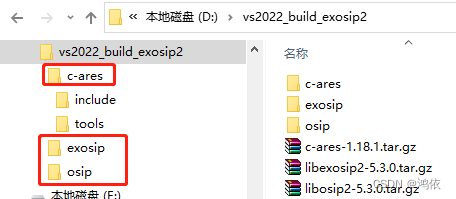

**vs工程配置及文件修改**

首先进入exosip\platform\vsnet，打开eXosip.sln后会加载相关项目，如图所示

第一项，项目配置升级到vs2022 v143 加载对应工程

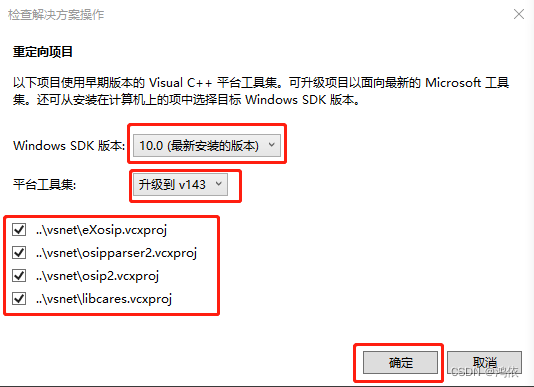

**第二项，增加头文件引用目录**

在eXosip 和 libcares两个项目属性中， 选c/c++常规，在附加包含目录编辑添加新的引用目录：

	..\..\..\c-ares\include

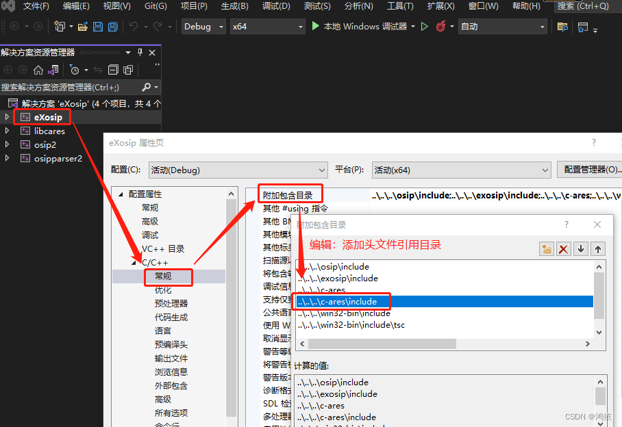

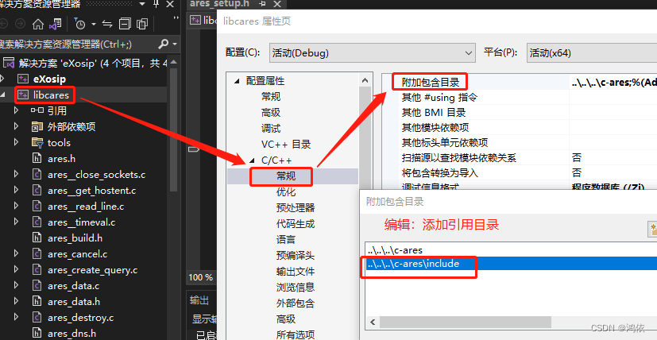

**第三项，添加tools文件**

在libcares项目中添加 c-ares/tools中的两个文件, 同时删除libcares项目中原有的这两个文件，参考后图

```
ares_getopt.c
ares_getopt.h
```

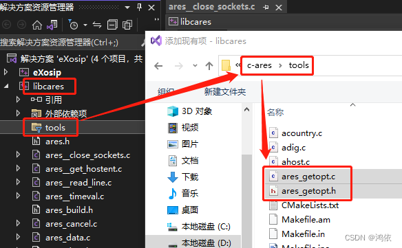

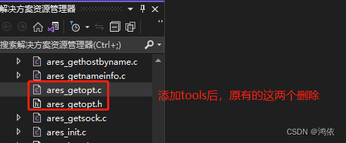

**第四项，添加以下文件 （避免编译程序时遇到以下链接错误）**

libcares.vcxproj下加入c-ares下五个文件

```
ares_platform.h,
ares_platform.c,
ares_create_query.c,
ares_strsplit.c,
ares_strsplit.h
```

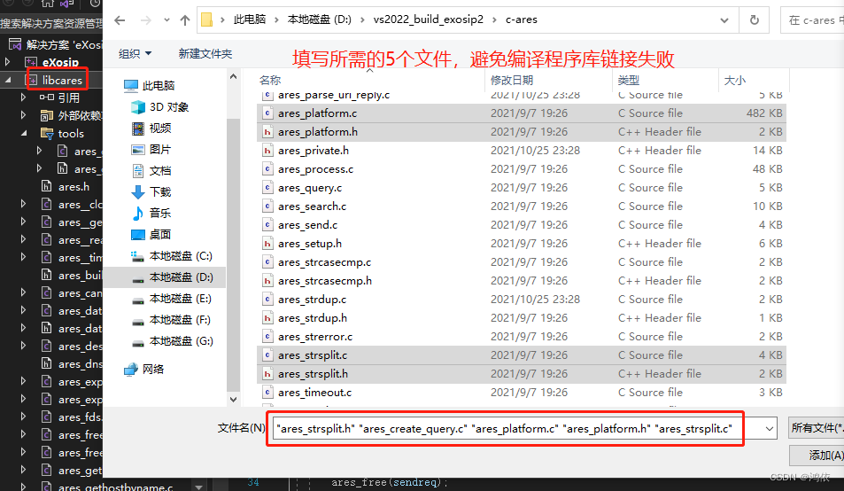

这些文件避免编译可执行程序链接库时会出现一下错误

```
error LNK2019:无法解析的外部符号_ares_getplatform，该符号在函数_get_DNS_Registry中被引用。
error LNK2019:无法解析的外部符号_ares_create_query,该符号在函数_ares_query中被引用。
```

**第五项，去掉有关宏定义**

在eXosip项目属性 选c/c++ 预处理器中的预处理器定义，去掉宏HAVE_OPENSSL_SSL_H，不然在编译的时候出现

	fatal  error C1083: 无法打开包括文件: “openssl/opensslv.h”: No such file or directory

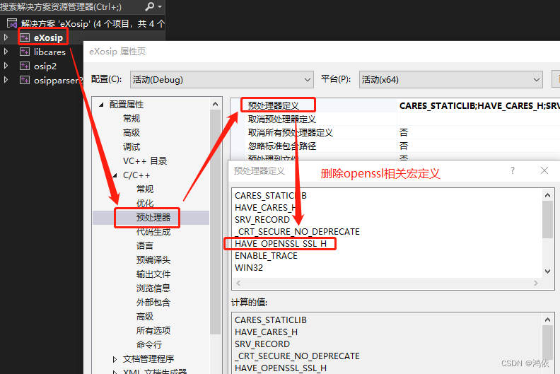

**第六项，修改个别代码**

遇到下面错误时，因c-ares中头文件的命名变化，“nameser.h” -> “ares_nameser.h”

	exosip\src\eXutils.c(1646,10): fatal  error C1083: 无法打开包括文件: “nameser.h”: No such file or directory

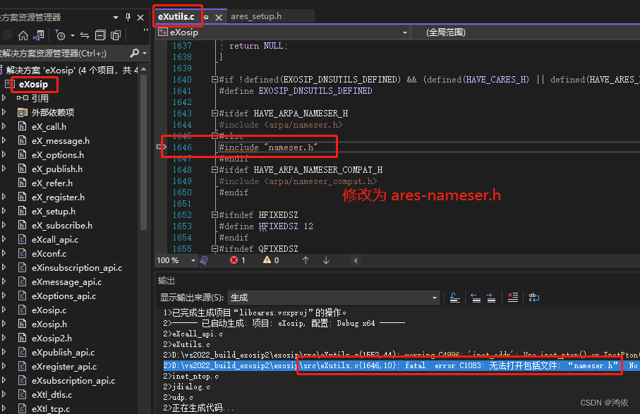

**编译结果**

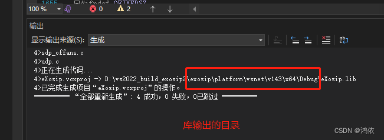

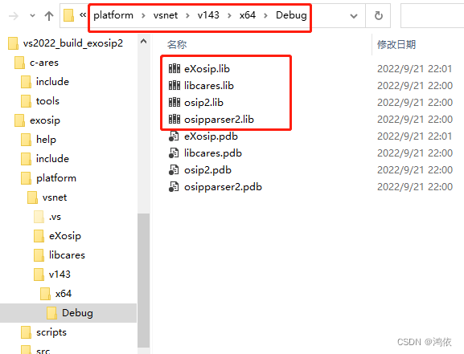

**工程增加相应系统库，避免链接错误**

和vs2015类似，编译可执行程序时需要再链接库中增加以下这些避免出错：为了方便读者复制，带上分号

	Dnsapi.lib;Iphlpapi.lib;ws2_32.lib;eXosip.lib;osip2.lib;osipparser2.lib;Qwave.lib;libcares.lib;delayimp.lib;

缺少delayimp.lib， Qwave.lib会出现 dns等报错；

例如：

	error LNK2001: 无法解析的外部符号 ___HrLoadAllImportsForDll

如图所示

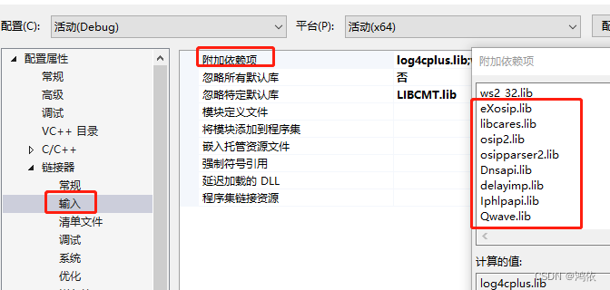

Author

Email: hybase@qq.com QQ: 23207689 WeChat: hybase

附注：Linux的编译较为简单

只需参考 ./configure --help就按步骤完成；

————————————————

版权声明：本文为CSDN博主「鸿依」的原创文章，遵循CC 4.0 BY-SA版权协议，转载请附上原文出处链接及本声明。

原文链接：https://blog.csdn.net/zymill/article/details/126982010
