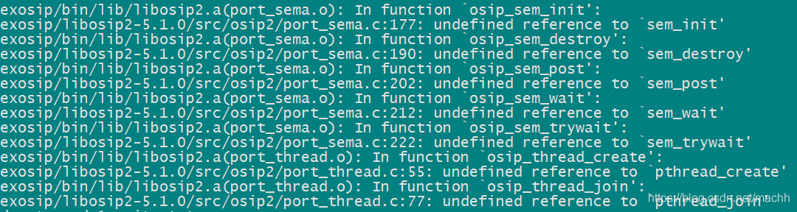
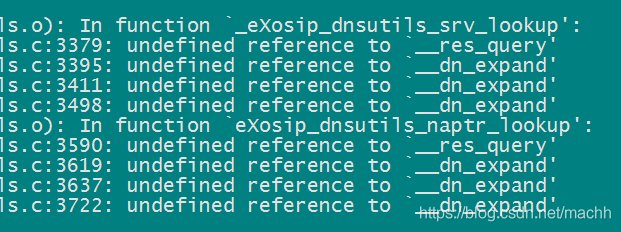
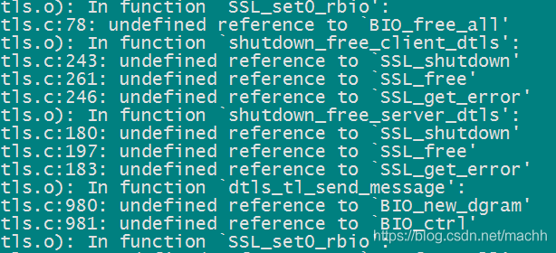

# centos编译exosip2 -5.1.0 #

编译环境
centos7.3
gcc4.8.5

## 1、下载 ##

> 链接：https://pan.baidu.com/s/1FNabcgatCvSKzX5fnU8EPw&shfl=sharepset
>  提取码：vpgh

libosip2-5.1.0.tar.gz
http://ftp.gnu.org/gnu/osip/

libexosip2-5.1.0.tar.gz
http://download.savannah.nongnu.org/releases/exosip/

c-ares-1.15.0.tar.gz
https://c-ares.haxx.se/

## 2、编译c-ares ##

    cd c-ares-1.15.0
	./configure --prefix=/home/sip/
	make
	make install

## 3、编译osip库 ##

	cd libosip2-5.1.0
	./configure --prefix=/home/sip/
	make
	make install

可选命令：

> –-prefix=/home/sip/设置安装目录，make install时生成的文件会放在这里 
> --enable-static 禁止生成动态库，只生成静态库

## 4、编译exosip库 ##

	cd  libexosip2-5.1.0
	./configure  --prefix=/home/sip/
	make
	make install

## 5、测试程序 ##

```
#include <iostream>
#include <eXosip2/eXosip.h>
#include <unistd.h>
#include <string.h>
#include <errno.h>
#include <sys/types.h>
#include <sys/socket.h>
#include <netinet/in.h>

int main()
{
        eXosip_t* sip = eXosip_malloc();
        if (eXosip_init(sip) == OSIP_SUCCESS)
        {
                std::cout << "exosip init success" << std::endl;
                if (eXosip_listen_addr(sip, IPPROTO_UDP, NULL, 8080, AF_INET, 0) == OSIP_SUCCESS)
                {
                        std::cout << "exosip listen addr success" << std::endl;
                }
        }
        eXosip_quit(sip);
        return 0;
}
```

## 6、错误处理 ##

	g++ test.cpp -o demo -leXosip2 -I /home/sip/include -L /home/sip/lib -losip2 -losipparser2 -leXosip2  

注意 -losip2 -losipparser2 -leXosip2 的顺序

出现一大堆连接错误，逐一分析如下

错误一：



 解决： 用到了 pthread 线程库， 需要连接libpthread

	g++ test.cpp -o demo -leXosip2 -I /home/sip/include -L /home/sip/lib -losip2 -losipparser2 -leXosip2  lpthread

错误二：



res_query，dn_expand两个函数是在glibc下面的libresolv库中实现的 ，编译时需要连接到libresolv.a

	g++ test.cpp -o demo -leXosip2 -I /home/sip/include -L /home/sip/lib -losip2 -losipparser2 -leXosip2  lpthread   -lresolv 

错误三：



res_query，dn_expand两个函数是在glibc下面的libresolv库中实现的 ，编译时需要连接到libresolv.a

```
--enable-openssl      enable support for openssl [default=yes] 
SSL_CFLAGS  		  C compiler flags for SSL, overriding pkg-config 
SSL_LIBS   			  linker flags for SSL, overriding pkg-config
```

exosip默认是开启 SSL的，所以在编译exosip库的时候需要指定 openssl的路径

 如果openssl库位置不是默认，需另外定义

```
CFLAGS="-I/home/ssl/include"
LDFLAGS="-L/home/ssl/lib/"
LIBS="-lssl -lcrypto"
```

我这里不想使用ssl 所以编译命令如下

 ./configure --prefix=/home/sip --disable-openssl

最后：

	g++ test.cpp -o demo -I /home/sip/include -L /home/sip/lib -leXosip2  -losip2 -losipparser2  -lpthread -ldl -lresolv 

执行程序：

	./demo 

输出：

    exosip init success！
    exosip listen addr success
